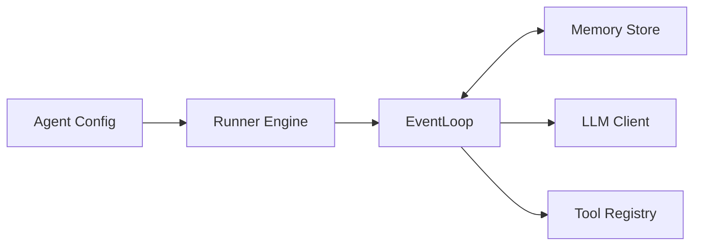

# Agent Forge Kit (AFK) Python SDK (v1.0.0)

**A production-grade framework for building robust, deterministic agent systems.**

**Documentation:** [afk.arpan.sh](https://afk.arpan.sh)

AFK is built for engineers who need more than just a "chat loop." It provides a typed, observable, and fail-safe runtime for orchestrating complex agent behaviors, managing long-running threads, and integrating with your existing infrastructure.

## Architecture

The framework is built on three core pillars:

1.  **Agent**: Stateless definition of identity, instructions, and tools.
2.  **Runner**: Stateful execution engine managing the event loop and memory.
3.  **Runtime**: Underlying capabilities (LLM I/O, Tool Registry).



## Key Capabilities

- **Deterministic Orchestration**: Type-safe event loop with guaranteed lifecycle events.
- **Fail-Safe Runtime**: Configurable circuit breakers, cost limits, and retry policies.
- **Observability First**: Built-in OpenTelemetry tracing and structured metrics.
- **Deep Tooling**: Secure tool execution with policy hooks and sandbox profiles.
- **Scalable Memory**: Pluggable backends (SQLite, Redis, Postgres) with auto-compaction.
- **Workflow State Machine**: Build complex multi-step workflows with DAG-like state machines.
- **Policy Audit Logging**: SOC2/GDPR compliant audit trails for all policy decisions.
- **Checkpoint Replay API**: First-class human-in-loop review and rollback support.

## Why AFK

AFK is for teams moving from demos to production agents.

- Use AFK when you need **predictable runs**, **typed tool contracts**, and **policy-gated actions**.
- Use AFK when reliability matters: retries, limits, circuit breakers, observability, and evals are built in.
- Use AFK when you want provider flexibility without rewriting agent logic for each model vendor.

Choose AFK over raw SDK calls when your workflow includes tools, multi-step execution, approvals, or release gating.
Choose a raw SDK when you only need simple chat/completions and minimal runtime behavior.

## Installation

```bash
pip install the-afk==1.0.0
```

## Quick Start

The `Runner` supports both synchronous (script) and asynchronous (server) execution modes.

```python
import asyncio
from afk.agents import Agent
from afk.core import Runner

# 1. Define your agent (stateless)
agent = Agent(
    name="ops-bot",
    model="gpt-4.1-mini",
    instructions="You are a helpful SRE assistant.",
)

# 2. Run it (stateful)
async def main():
    runner = Runner()
    result = await runner.run(agent, user_message="Check system health")

    print(f"Status: {result.state}")
    print(f"Output: {result.final_text}")

if __name__ == "__main__":
    asyncio.run(main())
```

> **Note**: For scripts and CLI tools, you can use `runner.run_sync(...)`.

## Power User Features

AFK is designed for complexity. Here are some of the advanced features available out of the box:

### Fail-Safe Controls

Prevent runaway costs and infinite loops with `FailSafeConfig`.

```python
from afk.agents import FailSafeConfig

agent = Agent(
    ...,
    fail_safe=FailSafeConfig(
        max_steps=20,
        max_total_cost_usd=1.00,  # Hard stop at $1
        subagent_failure_policy="continue_with_error",
    )
)
```

[Read the Configuration Reference →](https://afk.arpan.sh/library/configuration-reference)

### Streaming

Build real-time UIs with the event stream API.

```python
handle = await runner.run_stream(agent, user_message="...")
async for event in handle:
    if event.type == "text_delta":
        print(event.text_delta, end="")
```

[Read the Streaming Guide →](https://afk.arpan.sh/library/streaming)

### Debug Mode

Use debugger facade or runner config:

```python
from afk.debugger import Debugger, DebuggerConfig

debugger = Debugger(DebuggerConfig(redact_secrets=True, verbosity="detailed"))
runner = debugger.runner()
```

```python
from afk.core import Runner, RunnerConfig

runner = Runner(config=RunnerConfig(debug=True))
```

### Reasoning Controls

Set agent defaults and optionally override per run:

```python
agent = Agent(
    ...,
    reasoning_enabled=True,
    reasoning_effort="low",
    reasoning_max_tokens=256,
)

result = await runner.run(
    agent,
    context={"_afk": {"reasoning": {"enabled": True, "effort": "high", "max_tokens": 512}}},
)
```

### Background Tools

Tools can defer long-running work and resolve later:

```python
from afk.tools import ToolResult, ToolDeferredHandle

return ToolResult(
    success=True,
    deferred=ToolDeferredHandle(
        ticket_id="build-1",
        tool_name="build_project",
        status="running",
        resume_hint="continue docs while build runs",
    ),
    metadata={"background_task": build_future},
)
```

### Evals

Test your agents with the built-in eval suite.

```python
from afk.evals import run_suite, EvalCase

await run_suite(
    cases=[
        EvalCase(input="Hello", assertions=[...])
    ]
)
```

[Read the Evals Guide →](https://afk.arpan.sh/library/evals)

### Workflow State Machine

Build complex multi-step workflows with a fluent state machine API:

```python
from afk.agents import WorkflowBuilder, WorkflowExecutor, WorkflowExecutionContext

workflow = WorkflowBuilder("deploy", "Deploy Service")
workflow.add_node("build", "Build image", timeout_s=300)
workflow.add_node("test", "Run tests", timeout_s=120)
workflow.add_node("deploy", "Deploy to K8s", timeout_s=60)
workflow.add_edge("build", "test").add_edge("test", "deploy")
workflow.set_initial("build")

spec = workflow.build()
executor = WorkflowExecutor()
context = WorkflowExecutionContext(
    workflow_id="deploy",
    run_id="run-1",
    thread_id="thread-1",
)
result = await executor.execute(spec, context)
```

### Policy Audit Logging

Compliance-ready audit logging for all policy decisions:

```python
from afk.agents import create_policy_audit_logger, AuditConfig

audit = create_policy_audit_logger(
    file_path="./audit.log",
    min_level="info",
)

# Log policy decisions
await audit.log_policy_decision(event, decision, run_id=run_id)

# Log tool executions
await audit.log_tool_execution("webfetch", allowed=True, run_id=run_id)

# Log approvals
await audit.log_approval(approved=True, run_id=run_id)
```

### Checkpoint Replay

Human-in-loop review with rollback support:

```python
from afk.agents import create_replay_api

api = create_replay_api(memory_store)

# Open review session
session = await api.open_session(run_id, thread_id)

# Get timeline
timeline = await api.get_timeline(run_id, thread_id)
for event in timeline.events:
    print(f"Step {event.step}: {event.summary}")

# Get snapshot at step
snapshot = await api.get_step_snapshot(run_id, thread_id, step=5)

# Rollback to earlier step
session = await api.rollback(session, target_step=3)
```

### Memory Auto-Compaction

Automatic memory management based on importance scoring:

```python
from afk.memory import MemoryCompactor, CompactionConfig

compactor = MemoryCompactor(
    CompactionConfig(
        enabled=True,
        trigger_threshold_bytes=5_000_000,  # 5MB
        target_size_bytes=2_000_000,   # 2MB
        pressure_threshold=0.7,      # 70%
        compaction_interval_s=60.0,    # Check every minute
    )
)

# Run compaction manually
result = await compactor.compact(events, thread_id)
print(f"Compacted {result.events_compacted} events, "
      f"saved {result.memory_saved_bytes} bytes")
```

## Documentation

- **[Configuration Reference](https://afk.arpan.sh/library/configuration-reference)**: Full list of options.
- **[API Reference](https://afk.arpan.sh/library/api-reference)**: Classes and methods.
- **[Architecture & Modules](https://afk.arpan.sh/library/full-module-reference)**: Inner workings.

## License

MIT. See `LICENSE`.
