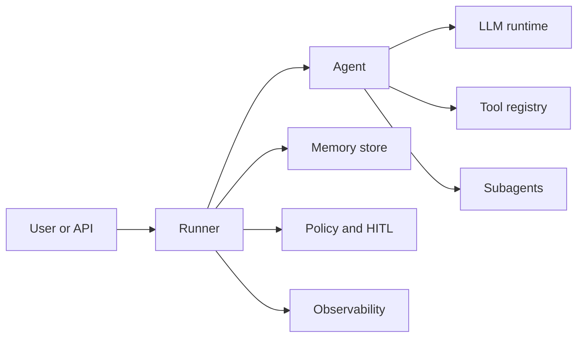

AFK is a Python 3.13+ SDK for building AI agents that need to run reliably outside a demo. You define agents, tools, policies, and memory as typed Python contracts. The runner handles the agent loop, LLM calls, tool execution, streaming, checkpoints, telemetry, and safety limits.

## Choose your path

<CardGroup cols={2}>
  <Card title="Build with AFK" icon="rocket" href="/library/quickstart">
    Start here if you are building an application, workflow, chatbot, coding tool,
    or production agent on top of AFK.
  </Card>
  <Card title="Maintain AFK" icon="code" href="/library/developer-guide">
    Start here if you are changing AFK itself, reviewing internals, or updating
    public contracts.
  </Card>
</CardGroup>

## Install

The distribution package is `afk-py`; the import package is `afk`.

<Tabs>
  <Tab title="pip">
  ```bash
  python -m pip install afk-py
  ```
  </Tab>
  <Tab title="uv">
  ```bash
  uv add afk-py
  ```
  </Tab>
  <Tab title="local repo">
  ```bash
  python -m pip install --upgrade pip
  python -m pip install -e . pytest
  ```
  </Tab>
</Tabs>

Set an LLM provider key before running examples:

```bash
export OPENAI_API_KEY="..."
```

## First agent

```python
from afk.agents import Agent
from afk.core import Runner

agent = Agent(
    name="assistant",
    model="gpt-4.1-mini",
    instructions="Answer directly with concrete detail.",
)

result = Runner().run_sync(
    agent,
    user_message="What is an error budget in SRE?",
)

print(result.final_text)
print(result.state)
```

What matters:

- `Agent` is configuration: model, instructions, tools, policies, subagents, and defaults.
- `Runner` is execution: LLM calls, tool calls, memory, streaming, checkpoints, and telemetry.
- `AgentResult` is the run record: final text, terminal state, tool/subagent records, usage, and cost.

## Core capabilities

<CardGroup cols={3}>
  <Card title="Agents" icon="robot" href="/library/agents">
    Declarative agent definitions with instructions, tools, subagents, skills,
    MCP servers, and safety limits.
  </Card>
  <Card title="Runner" icon="play" href="/library/core-runner">
    Sync, async, and streaming execution with lifecycle control and thread
    continuity.
  </Card>
  <Card title="Tools" icon="wrench" href="/library/tools">
    Typed Python tools with Pydantic validation, hooks, middleware, sandboxing,
    and bounded output.
  </Card>
  <Card title="LLM Runtime" icon="sparkles" href="/llms/index">
    Provider-portable LLM clients with retries, timeouts, rate limits, caching,
    circuit breakers, and fallback chains.
  </Card>
  <Card title="Memory" icon="database" href="/library/memory">
    Thread state, checkpoints, retention, compaction, and persistent stores.
  </Card>
  <Card title="Production" icon="shield" href="/library/building-with-ai">
    Evals, observability, queues, security controls, deployment guidance, and
    troubleshooting.
  </Card>
</CardGroup>

## AFK skills

Install the AFK skills with Vercel's Skills CLI when you want Codex or another supported agent to use AFK-specific guidance:

```bash
npx skills add https://github.com/arpan404/afk --skill afk-coder
npx skills add https://github.com/arpan404/afk --skill afk-maintainer
```

Use `afk-coder` when building applications with AFK. Use `afk-maintainer` when reviewing or changing AFK itself. See [Agent Skills](/library/agent-skills) for details.

## How AFK fits together



## Next steps

<CardGroup cols={2}>
  <Card title="Quickstart" icon="rocket" href="/library/quickstart">
    Build one runnable agent with one typed tool.
  </Card>
  <Card title="Learn AFK in 15 Minutes" icon="graduation-cap" href="/library/learn-in-15-minutes">
    Walk through agents, tools, streaming, memory, and safety.
  </Card>
  <Card title="Examples" icon="code" href="/library/examples/index">
    Find complete snippets by scenario.
  </Card>
  <Card title="API Reference" icon="book" href="/library/api-reference">
    Check canonical imports, signatures, result fields, and stability rules.
  </Card>
</CardGroup>
