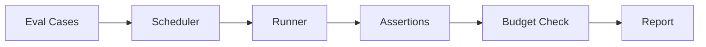

AFK evals run agents against named inputs and check the resulting state, text, tool usage, budgets, and telemetry. Use them for prompt changes, tool changes, routing changes, and regression tests. They can run against real providers, test adapters, or agents configured with deterministic tools.

## Your first eval

```python
from afk.agents import Agent
from afk.core import Runner
from afk.evals import EvalCase, EvalSuiteConfig, StateCompletedAssertion, run_suite

agent = Agent(
    name="classifier",
    model="gpt-5.5",
    instructions="Classify as: billing, technical, account, other. Output only the label.",
)

suite = run_suite(
    runner_factory=lambda: Runner(),
    cases=[
        EvalCase(
            name="billing-question",
            agent=agent,
            user_message="Why was I charged twice?",
        ),
        EvalCase(
            name="technical-question",
            agent=agent,
            user_message="The API returns a 500 error",
        ),
    ],
    config=EvalSuiteConfig(
        assertions=(StateCompletedAssertion(),),
    ),
)

print(f"Passed: {suite.passed}/{suite.total}")
assert suite.failed == 0
```

## Eval lifecycle



<Steps>
  <Step title="Define cases">
    Each case specifies an agent and input message. Suite-level assertions and budgets verify the result.
  </Step>
  <Step title="Schedule execution">
    The scheduler runs cases sequentially or in parallel, respecting concurrency
    limits.
  </Step>
  <Step title="Run agents">
    Each case runs through the same runner path your application uses.
  </Step>
  <Step title="Assert results">
    Assertions verify the result — text content, state, tool usage, cost,
    latency, etc.
  </Step>
  <Step title="Check budgets">
    Budget limits gate individual case costs and the total suite cost.
  </Step>
  <Step title="Generate report">
    Pass/fail results, assertion details, and metrics are collected into a
    report.
  </Step>
</Steps>

## Eval case types

<Tabs>
  <Tab title="Happy path">
    Verify correct behavior under normal conditions.

    ```python
    EvalCase(
        name="basic-greeting",
        agent=agent,
        user_message="Hello!",
    )
    ```

  </Tab>
  <Tab title="Failure path">
    Verify graceful handling of errors and edge cases.

    ```python
    EvalCase(
        name="invalid-input",
        agent=agent,
        user_message="",
    )
    ```

  </Tab>
  <Tab title="Tool usage">
    Verify that the agent uses tools correctly.

    ```python
    EvalCase(
        name="uses-search",
        agent=agent,
        user_message="Find docs about caching",
    )
    ```

  </Tab>
  <Tab title="Budget-constrained">
    Verify that the agent stays within cost limits.

    ```python
    EvalCase(
        name="within-budget",
        agent=agent,
        user_message="Analyze this dataset",
        budget=EvalBudget(max_total_cost_usd=0.05, max_total_tokens=4_000),
    )
    ```

  </Tab>
</Tabs>

## Assertions

Assertions are suite-level callables. Import the built-ins from `afk.evals`, or implement the `EvalAssertion` protocol.

```python
from afk.evals import FinalTextContainsAssertion, StateCompletedAssertion

assertions = (
    StateCompletedAssertion(),
    FinalTextContainsAssertion("error budget"),
)
```

## Suite configuration

```python
from afk.evals import EvalBudget, EvalSuiteConfig

config = EvalSuiteConfig(
    max_concurrency=3,         # Run up to 3 cases in parallel
    fail_fast=True,            # Stop on first failure
    budget=EvalBudget(
        max_total_cost_usd=1.00,  # Total suite budget
    ),
)

suite = run_suite(
    runner_factory=lambda: Runner(),
    cases=cases,
    config=config,
)
```

## CI integration

Run evals in your CI pipeline to gate releases:

```yaml
# .github/workflows/evals.yml
name: Agent Evals
on: [pull_request]

jobs:
  eval:
    runs-on: ubuntu-latest
    steps:
      - uses: actions/checkout@v4
      - run: python -m pip install afk-py pytest
      - run: python -m pytest tests/evals/ -v
        env:
          OPENAI_API_KEY: ${{ secrets.OPENAI_API_KEY }}
```

<Tip>
  **Set a budget for CI evals.** Without a budget, a broken prompt can drain
  your API credits during a CI run. Use `EvalBudget(max_total_cost_usd=2.00)` as
  a reasonable CI limit.
</Tip>

## Release gating

Gate releases on eval pass rate:

```python
suite = run_suite(runner_factory=lambda: Runner(), cases=cases)
pass_rate = suite.passed / suite.total if suite.total else 0.0

if pass_rate < 0.95:
    print(f"Release blocked: {pass_rate:.0%} pass rate (need 95%)")
    sys.exit(1)

print(f"Release approved: {pass_rate:.0%} pass rate")
```

## Next steps

<CardGroup cols={2}>
  <Card title="Security Model" icon="shield" href="/library/security-model">
    Security boundaries and production hardening.
  </Card>
  <Card title="Building with AI" icon="hammer" href="/library/building-with-ai">
    Production playbook with anti-patterns.
  </Card>
</CardGroup>
