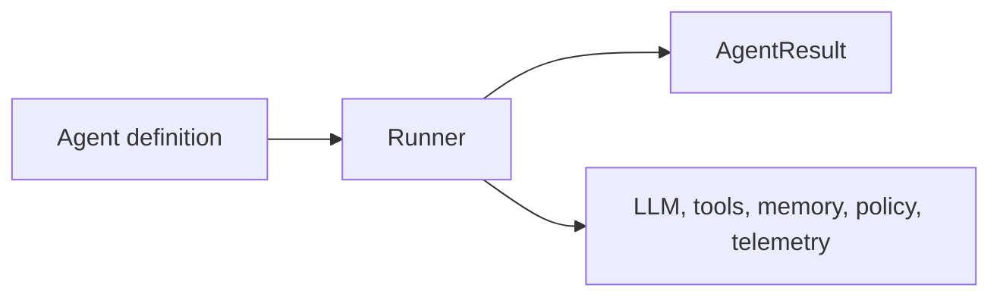

AFK is an agent runtime for Python applications. It is designed for teams that need agent behavior to be typed, observable, testable, and bounded by explicit controls.

The core idea is simple:

## The three core objects

| Object | What it owns | What it does not own |
| --- | --- | --- |
| `Agent` | Name, model, instructions, tools, subagents, skills, MCP servers, defaults, fail-safe limits | Network calls, event loops, persistence, telemetry export |
| `Runner` | Execution loop, tool dispatch, streaming, memory, checkpointing, policy/HITL, telemetry | Agent identity or instructions |
| `AgentResult` | Final text, terminal state, tool/subagent records, usage aggregate, cost, run/thread ids | Future execution |

This separation is the main design rule. Agents describe behavior. Runners execute behavior. Runtime subsystems provide capabilities.

## When AFK is a good fit

Use AFK when your agent will:

- call tools or external systems;
- run for more than one step;
- need cost, time, step, or tool-call limits;
- stream progress to a UI;
- persist memory or resume a run;
- require evals, telemetry, or production incident debugging;
- coordinate specialist subagents.

A direct LLM provider SDK may be simpler for one-off single-turn text generation. AFK is useful when the agent needs operational structure.

## Builder path

If you are building an app with AFK, read in this order:

1. [Quickstart](/library/quickstart) for the smallest complete agent.
2. [Learn AFK in 15 Minutes](/library/learn-in-15-minutes) for the guided path.
3. [Agents](/library/agents), [Runner](/library/core-runner), and [Tools](/library/tools) for the core building blocks.
4. [Building with AI](/library/building-with-ai), [Evals](/library/evals), and [Observability](/library/observability) before production.

## Maintainer path

If you are changing AFK itself, read in this order:

1. [Developer Guide](/library/developer-guide) for local setup, commands, and docs workflow.
2. [Architecture](/library/architecture) for package boundaries.
3. [Public API Rules](/library/public-imports-and-function-improvement) before changing exports or examples.
4. [Tested Behaviors](/library/tested-behaviors) before changing runner, tools, LLM runtime, memory, queues, or telemetry.

## Source-of-truth rules

- Public examples import from `afk.*`, never `src.afk.*`.
- `Runner` is imported from `afk.core`.
- User-facing docs should explain behavior before internals.
- Maintainer docs may reference internal modules, but must identify the public contract affected by a change.
- Generated agent-facing docs and skill indexes must be refreshed when navigation, examples, or skill references change.

## Next steps

<CardGroup cols={2}>
  <Card title="Quickstart" icon="rocket" href="/library/quickstart">
    Build one agent and one typed tool.
  </Card>
  <Card title="Developer Guide" icon="code" href="/library/developer-guide">
    Set up the repo and understand the contributor workflow.
  </Card>
</CardGroup>
