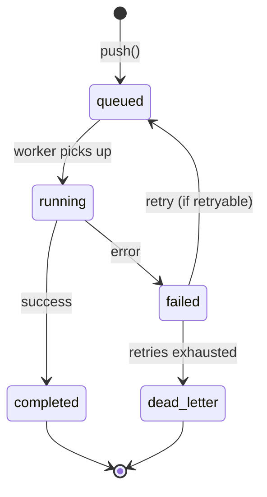

Task queues decouple agent work producers from consumers. Push a task, a worker picks it up, and the result is stored — independently of the caller's lifecycle. Use queues for long-running jobs, batch processing, and reliable retries.

## Quick start

```python
from afk.queues import InMemoryTaskQueue, RUNNER_CHAT_CONTRACT, TaskWorker
from afk.agents import Agent
from afk.core import Runner

agent = Agent(name="analyzer", model="gpt-5.5", instructions="Analyze data.")

# Push a task
queue = InMemoryTaskQueue()
await queue.enqueue_contract(
    RUNNER_CHAT_CONTRACT,
    payload={"user_message": "Analyze Q4 revenue trends"},
    agent_name="analyzer",
)

# A worker consumes queued tasks
worker = TaskWorker(queue, agents={"analyzer": agent}, runner_factory=lambda: Runner())
```

## Task lifecycle



| State         | Meaning                                     |
| ------------- | ------------------------------------------- |
| `queued`      | Waiting to be picked up by a worker         |
| `running`     | A worker is executing the task              |
| `completed`   | Task finished successfully                  |
| `failed`      | Task hit an error (may be retried)          |
| `dead_letter` | All retries exhausted — needs manual review |

## Execution contracts

Every task has a **contract** that defines what kind of work it represents:

<Tabs>
  <Tab title="runner.chat.v1">
    Standard agent chat. Runs an agent with a user message.

    ```python
    task = await queue.enqueue_contract(
        RUNNER_CHAT_CONTRACT,
        payload={
            "user_message": "Analyze this data",
            "context": {},
        },
        agent_name="analyzer",
    )
    ```

  </Tab>
  <Tab title="job.dispatch.v1">
    Generic job dispatch. Runs a custom handler function.

    ```python
    task = await queue.enqueue_contract(
        JOB_DISPATCH_CONTRACT,
        payload={
            "job_type": "process_report",
            "arguments": {"report_id": "R-123", "format": "pdf"},
        },
    )
    ```

  </Tab>
  <Tab title="Custom contract">
    Define your own contract for specialized workloads:

    ```python
    task = await queue.enqueue_contract(
        "myapp.batch.v1",
        payload={
            "batch_id": "B-456",
            "items": ["item1", "item2", "item3"],
            "max_concurrency": 5,
        },
    )
    ```

    Register a handler for the contract on the worker side.

  </Tab>
</Tabs>

## Worker setup

<Steps>
  <Step title="Create a worker">
    ```python
    from afk.queues import InMemoryTaskQueue, TaskWorker

    queue = InMemoryTaskQueue()
    worker = TaskWorker(
        queue=queue,
        agents={"analyzer": agent},
    )
    ```

  </Step>
  <Step title="Register custom contract handlers">
    ```python
    from afk.queues import ExecutionContract, ExecutionContractContext

    class BatchContract(ExecutionContract):
        contract_id = "myapp.batch.v1"
        requires_agent = False

        async def execute(self, task_item, *, agent, worker_context: ExecutionContractContext) -> dict:
            results = await process_batch(task_item.payload["items"])
            return {"processed": len(results)}

    worker = TaskWorker(
        queue=queue,
        agents={"analyzer": agent},
        execution_contracts={"myapp.batch.v1": BatchContract()},
    )
    ```
  </Step>
  <Step title="Start the worker">
    ```python
    await worker.start()  # Runs until stopped
    ```
  </Step>
</Steps>

## Dead-letter handling

When a task exhausts all retries, it moves to the dead-letter queue (DLQ):

```python
# Check for dead letters
dead_letters = await queue.list_dead_letters()

for task in dead_letters:
    print(f"Failed: {task.id} — {task.error}")

# Retry manually after fixing the issue
moved = await queue.redrive_dead_letters()

# Or discard them
removed = await queue.purge_dead_letters()
```

## Error classification

The queue uses error classification to decide whether to retry:

| Error type    | Retried?                                                                             | Example                                          |
| ------------- | ------------------------------------------------------------------------------------ | ------------------------------------------------ |
| **Retryable** | <Icon icon="check" iconType="solid" color="#22c55e" /> (with backoff)                | Network timeout, rate limit, transient LLM error |
| **Terminal**  | <Icon icon="xmark" iconType="solid" color="#ef4444" /> (sent to DLQ)                 | Invalid arguments, auth failure, missing model   |
| **Non-fatal** | <Icon icon="xmark" iconType="solid" color="#ef4444" /> (task completes with warning) | Telemetry export failure                         |

## Queue backends

<Tabs>
  <Tab title="In-memory (default)">
    State lives in process memory. No setup required.

    ```python
    queue = InMemoryTaskQueue()
    ```

    **Use for:** Development, testing, prototyping.

  </Tab>
  <Tab title="Redis">
    Durable queue with persistence and multi-worker support.

    ```python
    from afk.queues import create_task_queue_from_env

    queue = create_task_queue_from_env()
    ```

    Set via environment variables:
    ```bash
    export AFK_QUEUE_BACKEND=redis
    export AFK_QUEUE_REDIS_URL=redis://localhost:6379/0
    ```

    **Use for:** Production deployments, multi-process workers.

  </Tab>
</Tabs>

### Connection pooling

For high-throughput production workloads, use `RedisConnectionPool` to manage connections efficiently:

```python
from afk.llms.cache.redis_pool import get_redis_pool, PoolConfig

# Create a pooled connection
pool = await get_redis_pool(
    "redis://localhost:6379/0",
    config=PoolConfig(
        max_connections=50,
        max_idle_connections=10,
        socket_timeout=5.0,
    ),
)

# Use in queue
queue = TaskQueue(
    backend="redis",
    redis_url="redis://localhost:6379/0",
)

# Health check
if await pool.health_check():
    print("Redis connection healthy")
```

The pool provides:
- Configurable max connections (default: 50)
- Idle connection management
- Automatic health checks
- Singleton access via `get_redis_pool()`

## Next steps

<CardGroup cols={2}>
  <Card title="MCP Server" icon="plug" href="/library/mcp-server">
    Expose tools via the Model Context Protocol.
  </Card>
  <Card title="Observability" icon="chart-bar" href="/library/observability">
    Monitor queue performance and worker health.
  </Card>
</CardGroup>
