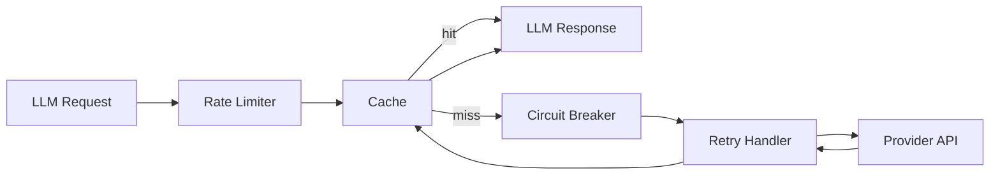

The LLM runtime includes built-in policies for handling transient failures, managing costs, and protecting against provider outages. Configure them via the builder profile or individual policy settings.

## Policy pipeline

Every LLM request passes through this policy chain:



## Built-in profiles

Use `profile()` to apply a curated set of policies:

```python
from afk.llms import LLMBuilder

# Development: no retry, no caching, fast failures
dev = LLMBuilder().provider("openai").model("gpt-5.5").profile("development").build()

# Production: retry, circuit breaker, rate limiting, caching
prod = LLMBuilder().provider("openai").model("gpt-5.5").profile("production").build()
```

| Profile       | Retry                           | Cache               | Rate Limit | Circuit Breaker        | Timeout |
| ------------- | ------------------------------- | ------------------- | ---------- | ---------------------- | ------- |
| `development` | None                            | None                | None       | None                   | 30s     |
| `production`  | 3 attempts, exponential backoff | In-memory, 5min TTL | 60 req/min | 5 failures → 30s open  | 60s     |
| `batch`       | 5 attempts, longer backoff      | None                | 20 req/min | 10 failures → 60s open | 120s    |

## Individual policies

Configure each policy independently with `create_llm_client()`:

<Tabs>
  <Tab title="Retry">
    Retry transient LLM failures with exponential backoff.

    ```python
    from afk.llms import LLMSettings, RetryPolicy, create_llm_client

    client = create_llm_client(
        provider="openai",
        settings=LLMSettings(default_model="gpt-5.5"),
        retry_policy=RetryPolicy(max_retries=3, backoff_base_s=1.0),
    )
    ```

    | Parameter | Default | Description |
    | --- | --- | --- |
    | `max_retries` | 3 | Retry attempts after the initial request |
    | `backoff_base_s` | 0.5 | Initial delay in seconds |
    | `backoff_jitter_s` | 0.15 | Jitter added to retry delays |
    | `require_idempotency_key` | `True` | Require idempotency keys for retried requests |

  </Tab>
  <Tab title="Circuit breaker">
    Stop calling a failing provider to prevent cascading failures.

    ```python
    from afk.llms import CircuitBreakerPolicy, LLMSettings, create_llm_client

    client = create_llm_client(
        provider="openai",
        settings=LLMSettings(default_model="gpt-5.5"),
        circuit_breaker_policy=CircuitBreakerPolicy(
            failure_threshold=5,
            cooldown_s=30.0,
        ),
    )
    ```

    ```mermaid
    stateDiagram-v2
        [*] --> Closed: normal operation
        Closed --> Open: failure_threshold exceeded
        Open --> HalfOpen: recovery_timeout elapsed
        HalfOpen --> Closed: test request succeeds
        HalfOpen --> Open: test request fails
    ```

  </Tab>
  <Tab title="Rate limiting">
    Prevent exceeding provider rate limits.

    ```python
    from afk.llms import LLMSettings, RateLimitPolicy, create_llm_client

    client = create_llm_client(
        provider="openai",
        settings=LLMSettings(default_model="gpt-5.5"),
        rate_limit_policy=RateLimitPolicy(requests_per_second=1.0, burst=10),
    )
    ```

  </Tab>
  <Tab title="Caching">
    Cache identical requests to reduce cost and latency.

    ```python
    from afk.llms import CachePolicy, LLMSettings, create_llm_client

    client = create_llm_client(
        provider="openai",
        settings=LLMSettings(default_model="gpt-5.5"),
        cache_policy=CachePolicy(enabled=True, ttl_s=300, namespace="docs"),
    )
    ```

    Cache keys are derived from request content, model settings, response model,
    session/checkpoint tokens, and any configured cache namespace. Cached rows do
    not retain provider request IDs, session tokens, checkpoint tokens, or raw
    provider payloads.

  </Tab>
  <Tab title="Timeout">
    Hard timeout on LLM requests.

    ```python
    from afk.llms import LLMSettings, TimeoutPolicy, create_llm_client

    client = create_llm_client(
        provider="openai",
        settings=LLMSettings(default_model="gpt-5.5"),
        timeout_policy=TimeoutPolicy(request_timeout_s=60.0),
    )
    ```

  </Tab>
</Tabs>

## Fallback chains

Configure a chain of models to try when the primary model fails:

```python
from afk.agents import Agent, FailSafeConfig

agent = Agent(
    name="resilient",
    model="gpt-5.5",
    fail_safe=FailSafeConfig(
        fallback_model_chain=["gpt-5.5", "gpt-5.5"],
    ),
)
# If gpt-5.5 fails → try gpt-5.5 → try gpt-5.5
```

## Tuning cheat sheet

| Goal              | Setting                                                       |
| ----------------- | ------------------------------------------------------------- |
| Reduce costs      | Lower temperature, use cheaper model, enable caching          |
| Reduce latency    | Enable caching, use faster model, set tight timeout           |
| Handle outages    | Enable retry + circuit breaker, add fallback chain            |
| High throughput   | Set rate limits high, use batch profile, increase concurrency |
| Consistent output | Set `temperature=0.0`, enable structured output               |

## Next steps

<CardGroup cols={2}>
  <Card title="Agent Integration" icon="link" href="/llms/agent-integration">
    How agents resolve and use LLM clients.
  </Card>
  <Card title="Observability" icon="chart-bar" href="/library/observability">
    Monitor LLM call latency, errors, and costs.
  </Card>
</CardGroup>
