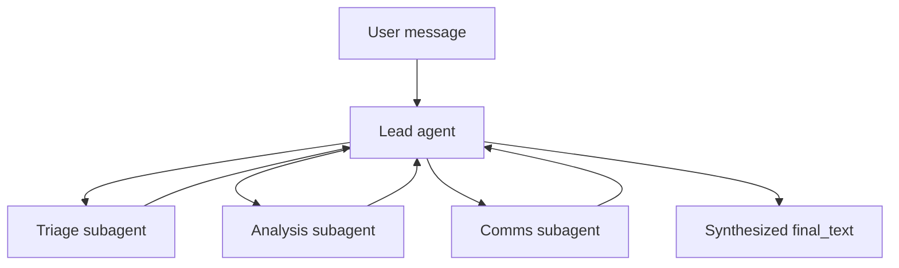
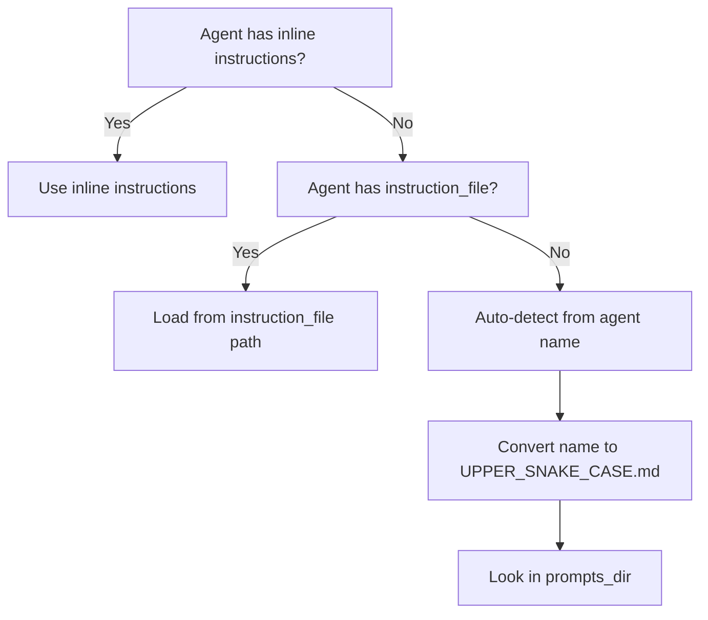
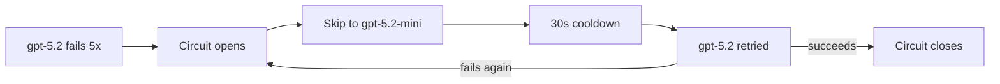

# AFK Examples

Merged from `docs/library/snippets/*.mdx` for agent-friendly context loading.

Generated at: 2026-05-20T19:18:48.145710+00:00

## 01_minimal_chat_agent

Source: `docs/library/snippets/01_minimal_chat_agent.mdx`

```python
---
title: "01: Minimal Chat Agent"
description: Smallest synchronous AFK agent run.
---

This is the simplest possible AFK agent. It demonstrates the three core concepts you need to get started: defining an `Agent` with a model and instructions, creating a `Runner` to execute it, and reading the result from `final_text`.

If you are new to AFK, start here. Every other example builds on this foundation.

```python
from afk.agents import Agent
from afk.core import Runner

agent = Agent(name="chat", model="gpt-5.2-mini", instructions="Answer directly with concrete detail.")
runner = Runner()
result = runner.run_sync(agent, user_message="Define error budget in SRE.")
print(result.final_text)
```

## Line-by-line explanation

**`Agent(...)`** defines the agent's identity and behavior. The `name` is used for telemetry and logging. The `model` specifies which LLM to use. The `instructions` become the system prompt that guides the model's behavior.

**`Runner()`** creates the execution engine. With no arguments, it uses in-memory defaults: headless interaction mode, no telemetry sink, and no policy engine. This is the fastest way to get started during development.

**`runner.run_sync(...)`** executes the agent synchronously, blocking until the run completes. Under the hood, this creates an async event loop, runs the agent through the full lifecycle (LLM call, optional tool execution, optional subagent delegation), and returns the terminal `AgentResult`. The `user_message` is the initial prompt sent to the model.

**`result.final_text`** contains the model's final text response. This is the primary output field on `AgentResult`. Always use `final_text` (not `output_text`) to access the agent's response.

## What AgentResult contains

The `AgentResult` dataclass returned by `run_sync` includes:

| Field | Type | Description |
| --- | --- | --- |
| `final_text` | `str` | The agent's final text response. |
| `state` | `str` | Terminal state: `"completed"`, `"failed"`, `"cancelled"`, or `"degraded"`. |
| `run_id` | `str` | Unique identifier for this run. |
| `thread_id` | `str` | Thread identifier for memory continuity across runs. |
| `tool_executions` | `list` | Records of all tool calls made during the run. |
| `subagent_executions` | `list` | Records of all subagent invocations. |
| `usage` | `UsageAggregate` | Token usage and cost estimates across all LLM calls. |

## Expected behavior

When you run this example, the runner makes a single LLM call to `gpt-5.2-mini` with the system instructions and user message. Since no tools are registered, the model responds with text only. The run completes in one step with `state="completed"`, and `final_text` contains a concise definition of error budgets in SRE.

No network calls, API keys, or external services are required beyond access to the specified LLM provider (configured via environment variables like `OPENAI_API_KEY`).
```

## 02_policy_with_hitl

Source: `docs/library/snippets/02_policy_with_hitl.mdx`

```python
---
title: "02: Policy with Human Interaction"
description: Route sensitive actions through policy and human approval.
---

Human-in-the-loop (HITL) is the pattern where the agent pauses execution to request approval or input from a human operator before proceeding with a sensitive action. This is critical for any agent that can take destructive or irreversible actions -- deleting data, modifying production systems, sending communications, or spending money.

AFK implements HITL through two components: a `PolicyEngine` that decides which actions require human intervention, and an `InteractionProvider` that routes the approval request to a human and returns their decision.

## Basic example

```python
from afk.agents import Agent, PolicyEngine, PolicyRule
from afk.core import Runner, RunnerConfig

# Define a policy that gates destructive operations
policy = PolicyEngine(rules=[
    PolicyRule(
        rule_id="gate-destructive-ops",
        description="Require human approval for any destructive operation",
        condition=lambda event: (
            event.tool_name is not None
            and any(keyword in event.tool_name.lower() for keyword in ["delete", "drop", "remove"])
        ),
        action="request_approval",
        reason="Destructive operations require human approval before execution.",
    ),
])

agent = Agent(
    name="change-manager",
    model="gpt-5.2-mini",
    instructions="You manage infrastructure changes. Always use available tools.",
)

# Headless mode: approval requests are auto-resolved using approval_fallback
runner = Runner(
    policy_engine=policy,
    config=RunnerConfig(
        interaction_mode="headless",
        approval_fallback="deny",  # Auto-deny in headless mode
    ),
)
result = runner.run_sync(agent, user_message="Drop old production tables")
print(f"State: {result.state}")
# In headless mode with approval_fallback="deny", the destructive action is blocked.
```

## Interactive mode with an InteractionProvider

In production, you typically want a real human to review approval requests. Use `interaction_mode="interactive"` with a custom `InteractionProvider`:

```python
from afk.core import Runner, RunnerConfig, InMemoryInteractiveProvider
from afk.agents import ApprovalDecision

# In-memory provider for testing (simulates human approval)
provider = InMemoryInteractiveProvider()

runner = Runner(
    policy_engine=policy,
    interaction_provider=provider,
    config=RunnerConfig(
        interaction_mode="interactive",
        approval_timeout_s=300.0,  # Wait up to 5 minutes for human response
    ),
)

# In a real application, a separate process or UI would call:
# provider.resolve_approval(request_id, ApprovalDecision(kind="allow"))
```

## Headless vs interactive modes

AFK supports three interaction modes, configured via `RunnerConfig.interaction_mode`:

| Mode | Behavior | When to Use |
| --- | --- | --- |
| `"headless"` | Approval requests are auto-resolved using `approval_fallback` (default: `"deny"`). No human is involved. | CI/CD pipelines, batch processing, testing, automated workflows where no human is available. |
| `"interactive"` | Approval requests are routed to the configured `InteractionProvider`. The runner pauses until a decision is returned or `approval_timeout_s` expires. | Production applications with human operators, chat UIs with approval buttons, Slack-based approval workflows. |
| `"external"` | Similar to interactive, but designed for use in external orchestration systems where the approval mechanism is managed outside AFK. | Enterprise systems with external approval platforms. |

## How the policy flow works

1. The agent calls a tool (e.g., `drop_table`).
2. Before executing, the runner sends a `PolicyEvent` to the `PolicyEngine`.
3. The engine evaluates all rules. If a rule matches, it returns a `PolicyDecision` with the configured action.
4. If the action is `request_approval`:
   - In **headless** mode: the runner auto-resolves using `approval_fallback`.
   - In **interactive** mode: the runner creates an `ApprovalRequest` and sends it to the `InteractionProvider`. Execution pauses until the provider returns an `ApprovalDecision`.
5. If approved (`kind="allow"`): the tool executes normally.
6. If denied (`kind="deny"`): the tool execution is skipped and the model receives a denial message as the tool result.
7. A `policy_decision` event is emitted in the run event stream for audit purposes.

## Policy decision actions

| Action | Effect |
| --- | --- |
| `"allow"` | Proceed with execution. No human interaction needed. |
| `"deny"` | Block execution immediately. The denial reason is reported to the model. |
| `"request_approval"` | Pause and request human approval through the `InteractionProvider`. |
| `"request_user_input"` | Pause and request freeform text input from a human operator. |
```

## 03_subagents_with_router

Source: `docs/library/snippets/03_subagents_with_router.mdx`

```python
---
title: "03: Subagents with Router"
description: Delegate workload to specialist subagents and merge outputs.
---

When a task is too complex for a single agent, AFK supports delegating subtasks to specialist subagents. The coordinator (or "lead") agent decides what to delegate, and the runner handles dispatching work to subagents, collecting their results, and feeding those results back to the coordinator for synthesis.

This pattern is useful for incident response, research workflows, content pipelines, and any scenario where different aspects of a task require distinct expertise or instructions.

## Delegation flow



## Example

```python
from afk.agents import Agent
from afk.core import Runner

# Define specialist subagents
triage = Agent(
    name="triage",
    model="gpt-5.2-mini",
    instructions="Classify incident severity as SEV1, SEV2, SEV3, or SEV4 based on the description.",
)
analysis = Agent(
    name="analysis",
    model="gpt-5.2-mini",
    instructions="Identify the most likely root causes for the described incident.",
)
comms = Agent(
    name="comms",
    model="gpt-5.2-mini",
    instructions="Draft a concise stakeholder update email summarizing the incident and current status.",
)

# Define the coordinator agent
lead = Agent(
    name="lead",
    model="gpt-5.2-mini",
    instructions="Delegate to specialists and synthesize their outputs into a final response.",
    subagents=[triage, analysis, comms],
)

runner = Runner()
result = runner.run_sync(lead, user_message="Investigate API latency spike and draft update")
print(result.final_text)
```

## How the coordinator pattern works

1. The **lead agent** receives the user message and decides how to delegate. It can invoke subagents through tool-like calls that the runner intercepts.

2. The **runner** dispatches each subagent invocation as a separate run. Subagents execute independently with their own instructions and model configuration. The runner manages concurrency, timeout, and failure handling for each subagent.

3. **Subagent results** are returned to the lead agent as execution records. Each record contains the subagent's `output_text` and optional error information.

4. The **lead agent** receives all subagent outputs and synthesizes them into a unified response. This final synthesis step is what produces the coordinator's `final_text`.

## What subagent_executions contains

The `AgentResult` returned by the lead agent includes a `subagent_executions` list. Each entry is a `SubagentExecutionRecord` with:

| Field | Type | Description |
| --- | --- | --- |
| `subagent_name` | `str` | Name of the subagent that was invoked. |
| `success` | `bool` | Whether the subagent completed successfully. |
| `output_text` | `str or None` | The subagent's response text, if it completed. |
| `latency_ms` | `float` | Wall-clock execution time in milliseconds. |
| `error` | `str or None` | Error message if the subagent failed. |

You can inspect these records to understand what each subagent contributed:

```python
result = runner.run_sync(lead, user_message="Investigate API latency spike")

for execution in result.subagent_executions:
    status = "OK" if execution.success else "FAILED"
    text = execution.output_text or ""
    print(f"  [{status}] {execution.subagent_name}: {text[:80]}...")
```

## Subagent failure handling

By default, subagent failure policy is `continue`. You can configure stricter or more resilient behavior using `FailSafeConfig`:

```python
from afk.agents import FailSafeConfig

lead = Agent(
    name="lead",
    model="gpt-5.2-mini",
    instructions="Delegate to specialists. If any specialist fails, work with available results.",
    subagents=[triage, analysis, comms],
    fail_safe=FailSafeConfig(
        subagent_failure_policy="retry_then_degrade",  # Continue with partial results
        max_subagent_depth=3,               # Prevent deep recursion
    ),
)
```

With `subagent_failure_policy="retry_then_degrade"`, the lead agent receives error information for failed subagents alongside successful results and can produce a best-effort synthesis.
```

## 04_resume_and_compact

Source: `docs/library/snippets/04_resume_and_compact.mdx`

```python
---
title: "04: Resume and Compact"
description: Resume interrupted runs from their last checkpoint and compact retained thread memory to control storage growth.
---

## What this snippet demonstrates

Agent runs can be interrupted by timeouts, cancellations, infrastructure failures, or intentional pauses (such as waiting for human approval). When a run is interrupted, the runner persists a checkpoint containing the run's state at the point of interruption. The `resume()` method picks up from that checkpoint, restoring the conversation history, tool execution records, and step counter so the agent continues where it left off rather than starting from scratch.

Over time, long-running threads accumulate checkpoint records, event logs, and state entries. The `compact_thread()` method prunes old records according to retention policies, keeping storage bounded without losing the data needed for active runs.

## Resuming an interrupted run

```python
import asyncio
from afk.agents import Agent
from afk.core import Runner, RunnerConfig

agent = Agent(
    name="research-bot",
    model="gpt-5.2-mini",
    instructions="You help users research topics thoroughly.",
)

runner = Runner(config=RunnerConfig(interaction_mode="headless"))


async def main():
    # Start a run that might be interrupted
    result = await runner.run(
        agent,
        user_message="Research the history of distributed systems.",
        thread_id="thread_research_001",
    )

    # Save these identifiers for later resume
    run_id = result.run_id
    thread_id = result.thread_id
    print(f"Run completed: state={result.state}")

    # Later, resume from the checkpoint if the run was interrupted.
    # The runner loads the latest checkpoint for this run_id + thread_id pair,
    # restores the conversation state, and continues execution.
    resumed_result = await runner.resume(
        agent,
        run_id=run_id,
        thread_id=thread_id,
    )
    print(f"Resumed run: state={resumed_result.state}")
    print(resumed_result.final_text)


asyncio.run(main())
```

### How resume works internally

The runner follows this sequence when `resume()` is called:

1. **Checkpoint lookup** -- The runner queries the memory store for the latest checkpoint matching the given `run_id` and `thread_id`. If no checkpoint exists, it raises `AgentCheckpointCorruptionError`.

2. **Terminal check** -- If the checkpoint already contains a terminal result (the run completed before the resume was requested), the runner returns that result immediately without re-executing.

3. **Snapshot restoration** -- The runner loads the runtime snapshot from the checkpoint, which includes the conversation message history, step counter, tool execution records, and any pending subagent state.

4. **Continued execution** -- The runner calls `run_handle()` internally with the restored snapshot, continuing the step loop from where it was interrupted.

### Resume method signature

```python
await runner.resume(
    agent,               # Agent definition (must match the original run's agent)
    run_id="run_123",    # The run_id from the interrupted run
    thread_id="th_abc",  # The thread_id from the interrupted run
    context=None,        # Optional context overlay for resumed execution
)
```

| Parameter | Type | Description |
| --- | --- | --- |
| `agent` | `BaseAgent` | The agent definition used for continued execution. Must match the agent that started the original run. |
| `run_id` | `str` | The unique run identifier from the interrupted run. Found on `result.run_id`. |
| `thread_id` | `str` | The thread identifier from the interrupted run. Found on `result.thread_id`. |
| `context` | `dict` or `None` | Optional context overlay. Merged with the original run context. |

## Compacting thread memory

```python
import asyncio
from afk.core import Runner, RunnerConfig
from afk.memory import RetentionPolicy, StateRetentionPolicy

runner = Runner(config=RunnerConfig(interaction_mode="headless"))


async def compact():
    compaction = await runner.compact_thread(
        thread_id="thread_research_001",
        event_policy=RetentionPolicy(max_age_ms=86_400_000),  # Keep last 24 hours
        state_policy=StateRetentionPolicy(max_entries=50),     # Keep last 50 state entries
    )
    print(f"Events removed: {compaction.events_removed}")
    print(f"States removed: {compaction.states_removed}")


asyncio.run(compact())
```

### How compaction works

Compaction operates on two dimensions of stored data:

- **Event retention** -- Controlled by `RetentionPolicy`. Removes event records older than `max_age_ms`. Events are the raw telemetry log entries (LLM calls, tool executions, state transitions) that accumulate over the lifetime of a thread.

- **State retention** -- Controlled by `StateRetentionPolicy`. Removes state entries that exceed `max_entries`, keeping only the most recent ones. State entries include checkpoint snapshots, conversation summaries, and key-value metadata.

Both policies are optional. If you omit a policy, that dimension is not compacted. The method returns a `MemoryCompactionResult` with counts of removed records so you can log or alert on compaction activity.

### When to compact

- **After long conversations** -- Threads with hundreds of turns accumulate large checkpoint histories. Compact after the conversation ends or reaches a natural break point.
- **On a schedule** -- Run compaction as a background task (e.g., hourly or daily) for threads that are still active but have grown large.
- **Before resume** -- If you know a thread has extensive history, compacting before resume reduces the data the runner needs to load.

## Error handling

```python
from afk.agents.errors import AgentCheckpointCorruptionError, AgentConfigurationError

try:
    result = await runner.resume(agent, run_id="invalid", thread_id="missing")
except AgentCheckpointCorruptionError:
    # No checkpoint found for this run_id + thread_id combination.
    # This means either the run_id is wrong, the checkpoint was compacted away,
    # or the memory store was cleared.
    print("No checkpoint found -- cannot resume.")
except AgentConfigurationError:
    # run_id or thread_id is empty or invalid
    print("Invalid run_id or thread_id.")
```

## What to read next

- [Memory](/library/memory) -- Full memory architecture, checkpoint schema, and retention policies.
- [Core Runner](/library/core-runner) -- Step loop lifecycle, state machine, and all runner API methods.
- [Checkpoint Schema](/library/checkpoint-schema) -- Exact structure of checkpoint records stored in memory.
```

## 05_direct_llm_structured_output

Source: `docs/library/snippets/05_direct_llm_structured_output.mdx`

```python
---
title: "05: Direct LLM Structured Output"
description: Use afk.llms with schema-validated responses.
---

Not every use case needs the full agent loop. Sometimes you want to call an LLM directly with a specific prompt and get back a structured, schema-validated response. AFK's `LLMBuilder` provides a fluent API for constructing LLM clients that can return Pydantic-validated objects directly, without the overhead of the agent run lifecycle.

Use this pattern for classification, extraction, summarization, and any scenario where you want a single LLM call with a guaranteed output schema.

## Example

```python
from pydantic import BaseModel
from afk.llms import LLMBuilder
from afk.llms.types import LLMRequest, Message

# Define the output schema as a Pydantic model
class Summary(BaseModel):
    title: str
    bullets: list[str]

# Build an LLM client using the fluent builder
client = LLMBuilder().provider("openai").model("gpt-5.2-mini").profile("production").build()

# Make a structured request
resp = await client.chat(
    LLMRequest(messages=[Message(role="user", content="Summarize incident timeline")]),
    response_model=Summary,
)
print(resp.structured_response)  # {"title": "...", "bullets": ["...", "..."]}
print(resp.text)                 # The raw text response
```

## The builder pattern

`LLMBuilder` uses a fluent (method-chaining) API to construct an LLM client with the exact configuration you need:

```python
client = (
    LLMBuilder()
    .provider("openai")          # Which LLM provider to use
    .model("gpt-5.2-mini")      # Which model
    .profile("production")       # Apply a preset profile (retry, timeout, etc.)
    .temperature(0.0)            # Override sampling temperature
    .max_tokens(1000)            # Set max response tokens
    .build()                     # Return the configured LLMClient
)
```

Each method returns the builder instance, so calls can be chained. The `.build()` call at the end constructs the final `LLMClient` with all specified settings.

Available builder methods:

| Method | Purpose |
| --- | --- |
| `.provider(name)` | Set the LLM provider (`"openai"`, `"litellm"`, `"anthropic_agent"`). |
| `.model(name)` | Set the model identifier. |
| `.profile(name)` | Apply a named configuration profile (`"production"`, `"development"`, etc.). |
| `.temperature(value)` | Set sampling temperature (0.0-2.0). |
| `.max_tokens(value)` | Set maximum response tokens. |
| `.top_p(value)` | Set nucleus sampling parameter. |
| `.timeout(seconds)` | Set request timeout. |
| `.build()` | Construct and return the `LLMClient`. |

## Structured output with Pydantic

When you pass `response_model=YourModel` to `client.chat()`, the client instructs the LLM to return output that conforms to the model's JSON schema. The response is parsed and validated against the Pydantic model:

- If the LLM returns valid structured output, `resp.structured_response` contains the parsed dictionary and `resp.text` contains the raw response.
- If the LLM returns output that does not match the schema, a `LLMInvalidResponseError` is raised.

This is powered by the LLM provider's native structured output support (e.g., OpenAI's `response_format` parameter) when available, with a fallback to prompt-based JSON extraction.

## When to use LLMBuilder vs Runner

| Use Case | Approach |
| --- | --- |
| Single LLM call, no tools, no memory | `LLMBuilder` -- simpler, faster, no lifecycle overhead. |
| Structured extraction or classification | `LLMBuilder` with `response_model`. |
| Multi-turn conversation with tools | `Runner` -- provides the full agent loop with tool execution, policy, and memory. |
| Subagent delegation | `Runner` -- only the runner supports subagent dispatch. |
| Event streaming to a UI | `Runner` with `run_stream()`. |
| Eval-driven development | `Runner` -- evals require the full `AgentResult` lifecycle. |

Use `LLMBuilder` when you want precision and control over a single LLM interaction. Use `Runner` when you need the full agentic lifecycle.
```

## 06_tool_registry_security

Source: `docs/library/snippets/06_tool_registry_security.mdx`

```python
---
title: "06: Tool Registry Security"
description: Safe tool registration and guardrail practices.
---

Tools are the primary way agents interact with external systems. A tool that reads data is fundamentally different from a tool that deletes resources -- and your security model should reflect this. AFK provides multiple layers of defense for tool security: scoped tool definitions with typed arguments, sandbox profiles that restrict execution capabilities, and policy gates that require human approval for destructive operations.

This page demonstrates how to register tools safely, distinguish between read-only and mutating tools, and configure policy gates to protect against unintended destructive actions.

## Read-only vs mutating tools

The most important security distinction is between tools that observe (read-only) and tools that act (mutating). Read-only tools are generally safe to allow broadly. Mutating tools should be tightly scoped and policy-gated.

```python
from pydantic import BaseModel
from afk.tools import tool, ToolResult

# --- Read-only tool: safe, broadly permitted ---
class LookupArgs(BaseModel):
    resource_id: str

@tool(
    args_model=LookupArgs,
    name="get_resource",
    description="Look up a resource by ID. Returns resource metadata. Read-only.",
)
def get_resource(args: LookupArgs) -> dict:
    return {"id": args.resource_id, "status": "active", "region": "us-east-1"}


# --- Mutating tool: destructive, requires policy gate ---
class DeleteArgs(BaseModel):
    resource_id: str

@tool(
    args_model=DeleteArgs,
    name="delete_resource",
    description="Permanently delete a resource by ID. This action is irreversible.",
)
def delete_resource(args: DeleteArgs) -> dict:
    # In production: call your API to delete the resource
    return {"deleted": args.resource_id}
```

Notice the differences:
- The read-only tool (`get_resource`) has a description that explicitly says "Read-only." This signals to both the model and human reviewers that the tool is safe.
- The mutating tool (`delete_resource`) has a description warning about irreversibility. This helps the model understand the severity, and helps policy rules identify destructive operations.

## Policy gate setup

Use a `PolicyEngine` to require human approval before any mutating tool executes:

```python
from afk.agents import Agent, PolicyEngine, PolicyRule, FailSafeConfig
from afk.core import Runner, RunnerConfig

# Define policy rules that distinguish read vs write operations
policy = PolicyEngine(rules=[
    PolicyRule(
        rule_id="gate-delete",
        description="Require approval for delete operations",
        condition=lambda event: event.tool_name == "delete_resource",
        action="request_approval",
        reason="Delete operations are irreversible and require human approval.",
    ),
    PolicyRule(
        rule_id="deny-unknown-tools",
        description="Deny any tool not explicitly registered",
        condition=lambda event: (
            event.tool_name is not None
            and event.tool_name not in {"get_resource", "delete_resource"}
        ),
        action="deny",
        reason="Unregistered tools are not permitted.",
    ),
])

agent = Agent(
    name="resource-manager",
    model="gpt-5.2-mini",
    instructions="Manage resources using the available tools. Always look up a resource before modifying it.",
    tools=[get_resource, delete_resource],
    fail_safe=FailSafeConfig(
        max_tool_calls=10,
        max_total_cost_usd=0.10,
    ),
)

runner = Runner(
    policy_engine=policy,
    config=RunnerConfig(
        interaction_mode="headless",
        approval_fallback="deny",     # Auto-deny destructive actions in headless mode
        sanitize_tool_output=True,    # Wrap tool output in untrusted-data markers
    ),
)

result = runner.run_sync(agent, user_message="Delete resource res-123")
print(f"State: {result.state}")
# In headless mode, the delete is auto-denied. The model sees the denial and responds accordingly.
```

## Sandbox profiles for filesystem tools

For tools that interact with the filesystem or execute commands, use `SandboxProfile` to restrict their capabilities:

```python
from afk.tools.security import SandboxProfile
from afk.core import RunnerConfig

config = RunnerConfig(
    default_sandbox_profile=SandboxProfile(
        profile_id="restricted",
        allow_network=False,                    # Block network access
        allow_command_execution=True,           # Allow shell commands
        allowed_command_prefixes=["ls", "cat"], # Only safe read commands
        deny_shell_operators=True,              # Block pipes, redirects, semicolons
        allowed_paths=["/app/data"],            # Restrict file access to data directory
        denied_paths=["/etc", "/root"],         # Explicitly deny sensitive paths
        command_timeout_s=10.0,                 # Kill commands after 10 seconds
        max_output_chars=5_000,                 # Truncate large outputs
    ),
)
```

## Scoping destructive tools

Follow these principles when registering destructive tools:

1. **Name them clearly.** Use verb prefixes that signal intent: `delete_`, `remove_`, `drop_`, `update_`, `modify_`. This makes policy rules easy to write and audit.

2. **Type all arguments.** Use Pydantic models for argument validation. Never accept freeform `dict` arguments for mutating operations.

3. **Describe irreversibility.** Include "irreversible", "destructive", or "permanent" in the tool description. This helps both the model and policy reviewers understand the risk.

4. **Gate with policy rules.** Every mutating tool should have a corresponding policy rule. Use `request_approval` for interactive environments and `deny` as the fallback in headless mode.

5. **Set cost limits.** Use `FailSafeConfig.max_tool_calls` and `max_total_cost_usd` to prevent runaway tool usage, especially when the agent has access to APIs with per-call costs.

6. **Audit everything.** Policy decisions are emitted as `policy_decision` events in the run event stream. Persist these events for compliance and debugging.
```

## 07_tool_hooks_and_middleware

Source: `docs/library/snippets/07_tool_hooks_and_middleware.mdx`

```python
---
title: "07: Tool Hooks and Middleware"
description: Add pre-execution validation, post-execution transformation, and cross-cutting middleware to tools and the LLM client pipeline.
---

## What this snippet demonstrates

AFK provides two distinct hook/middleware systems that operate at different layers:

1. **Tool hooks and middleware** -- Pre-hooks, post-hooks, and middleware that wrap individual tool executions. These use Pydantic models for typed arguments and run inside the tool execution pipeline.

2. **LLM middleware** -- Middleware that wraps LLM client operations (chat, stream, embed). These intercept requests and responses at the provider transport layer.

Both systems follow the same pattern: define a callable, wire it into the pipeline, and the runner executes it at the appropriate point in the lifecycle.

## Tool pre-hooks

A pre-hook runs before the main tool function executes. It receives the tool's arguments (validated against its own Pydantic model) and returns a dictionary of transformed arguments that the main tool will receive. Use pre-hooks for input sanitization, enrichment, or validation that should happen before execution.

```python
from pydantic import BaseModel, Field
from afk.tools.core.decorator import tool, prehook


# Pre-hook argument model matches the main tool's argument shape
class SearchArgs(BaseModel):
    query: str
    max_results: int = Field(default=10, ge=1, le=100)


# Pre-hook: sanitize and normalize the query before the tool runs
@prehook(args_model=SearchArgs, name="normalize_query")
async def normalize_query(args: SearchArgs) -> dict:
    """Strip extra whitespace and lowercase the query."""
    return {
        "query": " ".join(args.query.lower().split()),
        "max_results": min(args.max_results, 50),  # Cap at 50
    }


# Main tool with the pre-hook attached
@tool(
    args_model=SearchArgs,
    name="search_docs",
    description="Search the documentation index.",
    prehooks=[normalize_query],
)
async def search_docs(args: SearchArgs) -> dict:
    # args.query is already normalized by the pre-hook
    return {"results": [f"Result for: {args.query}"], "count": args.max_results}
```

### Pre-hook execution flow


The pre-hook receives validated arguments and must return a dictionary compatible with the main tool's `args_model`. If the returned dictionary fails validation against the tool's model, the tool call fails with a `ToolValidationError`.

## Tool post-hooks

A post-hook runs after the main tool function completes. It receives the tool output and can transform or annotate the result before it is returned to the LLM. Use post-hooks for output sanitization, logging, or enrichment.

```python
from pydantic import BaseModel
from typing import Any
from afk.tools.core.decorator import posthook


class PostHookArgs(BaseModel):
    output: Any
    tool_name: str | None = None


@posthook(args_model=PostHookArgs, name="redact_sensitive")
async def redact_sensitive(args: PostHookArgs) -> dict:
    """Remove sensitive fields from tool output before returning to LLM."""
    output = args.output
    if isinstance(output, dict):
        # Strip any fields that might contain secrets
        sanitized = {
            k: v for k, v in output.items()
            if k not in ("api_key", "secret", "password", "token")
        }
        return {"output": sanitized, "tool_name": args.tool_name}
    return {"output": output, "tool_name": args.tool_name}
```

AFK passes post-hooks a payload dictionary with the shape `{"output": <tool_output>, "tool_name": "<tool_name>"}`. The post-hook must return a dictionary with the same shape.

## Tool-level middleware

Tool-level middleware wraps around the entire tool execution, including pre-hooks and post-hooks. Middleware receives a `call_next` function and the tool arguments, and can modify behavior before, after, or around execution.

```python
from afk.tools.core.decorator import middleware


@middleware(name="timing_middleware")
async def timing_middleware(call_next, args, ctx):
    """Measure and log tool execution time."""
    import time
    start = time.monotonic()
    result = await call_next(args, ctx)
    elapsed_ms = (time.monotonic() - start) * 1000
    print(f"Tool executed in {elapsed_ms:.1f}ms")
    return result


@middleware(name="retry_on_transient")
async def retry_on_transient(call_next, args, ctx):
    """Retry the tool once on transient errors."""
    try:
        return await call_next(args, ctx)
    except ConnectionError:
        # One retry on connection errors
        return await call_next(args, ctx)
```

### Attaching middleware to a tool

```python
@tool(
    args_model=SearchArgs,
    name="search_docs",
    description="Search the documentation index.",
    prehooks=[normalize_query],
    posthooks=[redact_sensitive],
    middlewares=[timing_middleware, retry_on_transient],
)
async def search_docs(args: SearchArgs) -> dict:
    return {"results": [...]}
```

Middleware executes in the order listed. The first middleware in the list is the outermost wrapper. Each middleware calls `call_next` to pass control to the next middleware (or the actual tool function if it is the last one).

## Registry-level middleware

Registry-level middleware applies to every tool in a `ToolRegistry`, not just a single tool. Use this for cross-cutting concerns like audit logging, rate limiting, or policy enforcement that should apply uniformly.

```python
from afk.tools.core.decorator import registry_middleware


@registry_middleware(name="audit_log")
async def audit_log(call_next, tool, raw_args, ctx):
    """Log every tool invocation for audit purposes."""
    print(f"AUDIT: tool={tool.spec.name} args={raw_args}")
    result = await call_next(tool, raw_args, ctx)
    print(f"AUDIT: tool={tool.spec.name} success={result.success}")
    return result
```

## LLM client middleware

LLM middleware operates at the provider transport layer, intercepting requests to and responses from the LLM API. AFK defines three middleware protocols for the three LLM operations:

```python
from afk.llms import LLMBuilder, LLMRequest, LLMResponse
from afk.llms.middleware import MiddlewareStack


# Chat middleware: intercepts non-streaming chat requests
async def add_request_metadata(call_next, req: LLMRequest) -> LLMResponse:
    """Add tracing metadata to every LLM request."""
    req.metadata = req.metadata or {}
    req.metadata["trace_id"] = "trace_abc123"
    return await call_next(req)


# Build client with middleware
client = (
    LLMBuilder()
    .provider("openai")
    .model("gpt-5.2-mini")
    .profile("production")
    .with_middlewares(MiddlewareStack(
        chat=[add_request_metadata],
        embed=[],
        stream=[],
    ))
    .build()
)
```

### LLM middleware protocols

| Protocol | Operation | Signature |
| --- | --- | --- |
| `LLMChatMiddleware` | Non-streaming chat | `async (call_next, req: LLMRequest) -> LLMResponse` |
| `LLMEmbedMiddleware` | Embeddings | `async (call_next, req: EmbeddingRequest) -> EmbeddingResponse` |
| `LLMStreamMiddleware` | Streaming chat | `(call_next, req: LLMRequest) -> AsyncIterator[LLMStreamEvent]` |

Each middleware receives `call_next` (the next middleware or transport in the chain) and the request object. It can modify the request before calling `call_next`, modify the response after, or short-circuit entirely by returning a response without calling `call_next`.

## Built-in LLM middleware

AFK ships with pre-built middleware for common patterns:

### Timeout middleware

Apply per-request timeouts to prevent runaway calls:

```python
from afk.llms.middleware.timeout import (
    TimeoutMiddleware,
    EmbedTimeoutMiddleware,
    StreamTimeoutMiddleware,
    TimeoutConfig,
)
from afk.llms.middleware import MiddlewareStack

# Configure timeouts
config = TimeoutConfig(
    default_timeout_s=30.0,
    chat_timeout_s=60.0,
    embed_timeout_s=15.0,
    stream_timeout_s=45.0,
)

# Add to middleware stack
stack = MiddlewareStack(
    chat=[TimeoutMiddleware(config)],
    embed=[EmbedTimeoutMiddleware(config)],
    stream=[StreamTimeoutMiddleware(config)],
)

# Build client
client = (
    LLMBuilder()
    .provider("openai")
    .model("gpt-5.2-mini")
    .with_middlewares(stack)
    .build()
)
```

The timeout middleware respects `TimeoutPolicy` from the request if provided:
```python
req = LLMRequest(
    model="gpt-5.2-mini",
    messages=[...],
    timeout_policy=TimeoutPolicy(request_timeout_s=45.0),  # Override config
)
```

## When to use each layer

| Layer | Scope | Use for |
| --- | --- | --- |
| **Tool pre-hook** | Single tool, before execution | Input sanitization, argument enrichment, validation |
| **Tool post-hook** | Single tool, after execution | Output sanitization, redaction, annotation |
| **Tool middleware** | Single tool, wraps execution | Timing, retries, caching, error handling |
| **Registry middleware** | All tools in registry | Audit logging, rate limiting, policy enforcement |
| **LLM middleware** | All LLM calls through client | Request metadata, response logging, tracing |

## What to read next

- [Tools](/library/tools) -- Full tool system architecture, the 6-step execution pipeline, and design guidelines.
- [Tool Call Lifecycle](/library/tool-call-lifecycle) -- Detailed lifecycle of a tool call from LLM proposal to result delivery.
- [LLMs Overview](/llms/index) -- Builder workflow, runtime profiles, and provider selection.
```

## 08_prebuilt_runtime_tools

Source: `docs/library/snippets/08_prebuilt_runtime_tools.mdx`

```python
---
title: "08: Prebuilt Runtime Tools"
description: Use AFK's built-in filesystem tools with directory-scoped security constraints and compose them with policy checks.
---

## What this snippet demonstrates

AFK ships prebuilt tools for common runtime operations like listing directories and reading files. These tools are designed with security-first defaults: every tool is scoped to an explicit root directory that prevents directory traversal attacks. This snippet shows how to create, configure, and compose prebuilt tools with agents and policy guards.

## Building runtime tools

The `build_runtime_tools()` factory creates a set of filesystem tools bound to a specific root directory. All path operations within these tools are resolved against this root, and any attempt to access files outside it raises a `FileAccessError`.

```python
from pathlib import Path
from afk.agents import Agent
from afk.core import Runner, RunnerConfig
from afk.tools.prebuilts.runtime import build_runtime_tools

# Create filesystem tools scoped to a specific directory
runtime_tools = build_runtime_tools(root_dir=Path("./workspace"))

agent = Agent(
    name="file-assistant",
    model="gpt-5.2-mini",
    instructions=(
        "You help users explore and read files in the workspace directory. "
        "Use list_directory to browse the directory structure and read_file "
        "to read file contents. You cannot access files outside the workspace."
    ),
    tools=runtime_tools,
)

runner = Runner(config=RunnerConfig(interaction_mode="headless"))
result = runner.run_sync(agent, user_message="What files are in the workspace?")
print(result.final_text)
```

## Available prebuilt tools

The `build_runtime_tools()` factory produces two tools:

### list_directory

Lists entries in a directory under the configured root. Returns entry names, paths, and type flags (file or directory).

| Parameter     | Type  | Default | Description                                                       |
| ------------- | ----- | ------- | ----------------------------------------------------------------- |
| `path`        | `str` | `"."`   | Relative path to list, resolved against the root directory.       |
| `max_entries` | `int` | `200`   | Maximum entries to return (1--5000). Prevents unbounded listings. |

**Returns:** A dictionary with `root`, `path`, and `entries` (list of `{name, path, is_dir, is_file}`).

### read_file

Reads the contents of a file under the configured root, with configurable truncation to prevent excessive token consumption.

| Parameter   | Type  | Default    | Description                                                                      |
| ----------- | ----- | ---------- | -------------------------------------------------------------------------------- |
| `path`      | `str` | (required) | Relative path to the file, resolved against the root directory.                  |
| `max_chars` | `int` | `20_000`   | Maximum characters to read (1--500,000). Content is truncated beyond this limit. |

**Returns:** A dictionary with `root`, `path`, `content`, and `truncated` (boolean indicating whether content was truncated).

## Security: directory traversal prevention

Every path operation is validated with an internal containment check that uses Python's `Path.relative_to()` to verify that the resolved path stays within the configured root. This prevents attacks like:

```
../../etc/passwd           # Blocked: escapes root
/absolute/path/to/secrets  # Blocked: escapes root
./workspace/../../../etc   # Blocked: resolved path escapes root
```

If a path escapes the root, the tool raises `FileAccessError` immediately, before any file I/O occurs.

## Composing with policy checks

For additional security, pair runtime tools with a policy engine that gates specific operations on approval:

```python
from afk.agents import Agent, PolicyEngine, PolicyRule

# Define a policy that requires approval for reading certain files
policy = PolicyEngine(
    rules=[
        PolicyRule(
            tool_name="read_file",
            description="Require approval for reading config files",
            condition=lambda event: ".env" in event.tool_args.get("path", "")
                or "config" in event.tool_args.get("path", ""),
            action="request_approval",
            approval_message="Agent wants to read a config file: {path}",
        ),
    ]
)

agent = Agent(
    name="ops-assistant",
    model="gpt-5.2-mini",
    instructions="Use approved runtime tools only. Never read sensitive configuration without approval.",
    tools=build_runtime_tools(root_dir=Path("./project")),
)

runner = Runner(
    policy_engine=policy,
    config=RunnerConfig(interaction_mode="headless"),
)
```

## Composing with custom tools

You can combine prebuilt tools with your own custom tools in a single agent:

```python
from pydantic import BaseModel
from afk.tools import tool


class GrepArgs(BaseModel):
    pattern: str
    path: str = "."


@tool(
    args_model=GrepArgs,
    name="grep_files",
    description="Search for a pattern in files within the workspace.",
)
async def grep_files(args: GrepArgs) -> dict:
    # Your custom search implementation
    return {"matches": [], "pattern": args.pattern}


# Combine prebuilt + custom tools
all_tools = build_runtime_tools(root_dir=Path("./workspace")) + [grep_files]

agent = Agent(
    name="dev-assistant",
    model="gpt-5.2-mini",
    instructions="Help developers explore and search the codebase.",
    tools=all_tools,
)
```

## Command allowlists and sandbox profiles

For production environments, restrict tool capabilities further using sandbox profiles:

```python
from afk.tools.security import SandboxProfile

# Create a read-only sandbox that restricts what operations tools can perform
read_only_profile = SandboxProfile(
    name="read_only",
    allowed_operations=["read", "list"],
    denied_operations=["write", "delete", "execute"],
    max_file_size_bytes=1_000_000,        # 1 MB max read size
    allowed_extensions=[".py", ".md", ".txt", ".json", ".yaml"],
)
```

This ensures that even if the LLM attempts to use tools for unauthorized operations, the sandbox profile blocks execution before any I/O occurs.

## What to read next

- [Tools](/library/tools) -- Full tool system architecture, including the `@tool` decorator, `ToolResult`, and execution pipeline.
- [Snippet 06: Tool Registry Security](/library/snippets/06_tool_registry_security) -- Security scoping, policy gates, and sandbox profiles in detail.
- [Security Model](/library/security-model) -- Threat model, defense layers, and RunnerConfig security fields.
```

## 09_system_prompt_loader

Source: `docs/library/snippets/09_system_prompt_loader.mdx`

```python
---
title: "09: System Prompt Loader"
description: Resolve agent system prompts from a file hierarchy with deterministic precedence, Jinja templating, and stat-based caching.
---

## What this snippet demonstrates

AFK agents need system prompts (instructions) that tell the LLM how to behave. Rather than hardcoding instructions as inline strings, AFK provides a file-based prompt resolution system that loads prompts from a directory hierarchy. This keeps prompts version-controlled, editable by non-developers, and reusable across agents.

The prompt loader resolves instructions through a deterministic precedence chain, supports Jinja2 templating for dynamic prompts, and caches compiled templates using stat-based invalidation for hot-reload during development.

## Resolution precedence

The prompt system resolves agent instructions through this priority chain:



1. **Inline `instructions`** -- If the agent has a non-empty `instructions` string, it is used directly. No file loading occurs.
2. **Explicit `instruction_file`** -- If set, the file is loaded from the configured `prompts_dir`. The path must resolve to a file inside the prompts root (no directory traversal).
3. **Auto-detected file** -- If neither is set, the agent's name is converted to `UPPER_SNAKE_CASE.md` and loaded from `prompts_dir`.

## Basic usage

```python
from afk.agents import Agent

# Option 1: Inline instructions (highest priority)
agent = Agent(
    name="ChatAgent",
    model="gpt-5.2-mini",
    instructions="Answer customer questions concisely.",
)

# Option 2: Explicit instruction file
agent = Agent(
    name="ChatAgent",
    model="gpt-5.2-mini",
    instruction_file="chat_agent_system.md",   # Loaded from prompts_dir
    prompts_dir=".agents/prompt",
)

# Option 3: Auto-detected file (uses agent name)
# Loads .agents/prompt/CHAT_AGENT.md automatically
agent = Agent(
    name="ChatAgent",
    model="gpt-5.2-mini",
    prompts_dir=".agents/prompt",
)
```

## Name-to-filename conversion

The auto-detection algorithm converts the agent name to a filename using these rules:

| Agent Name | Derived Filename | Rule Applied |
| --- | --- | --- |
| `ChatAgent` | `CHAT_AGENT.md` | CamelCase split on boundaries |
| `chatagent` | `CHAT_AGENT.md` | Lowercase `agent` suffix detected and split |
| `research-assistant` | `RESEARCH_ASSISTANT.md` | Hyphens replaced with underscores |
| `QA Bot v2` | `QA_BOT_V2.md` | Spaces and non-alphanumeric chars become underscores |

The conversion is handled by `derive_auto_prompt_filename()` internally. It splits camelCase boundaries, normalizes non-alphanumeric characters to underscores, collapses consecutive underscores, and uppercases the result.

## Prompts directory resolution

The prompts directory is resolved through its own priority chain:

1. Explicit `prompts_dir` argument on the `Agent` constructor.
2. `AFK_AGENT_PROMPTS_DIR` environment variable.
3. Default: `.agents/prompt` relative to the current working directory.

```python
# Explicit
agent = Agent(name="Bot", model="gpt-5.2-mini", prompts_dir="/opt/prompts")

# Environment variable
# export AFK_AGENT_PROMPTS_DIR=/opt/prompts
agent = Agent(name="Bot", model="gpt-5.2-mini")

# Default: .agents/prompt/
agent = Agent(name="Bot", model="gpt-5.2-mini")
```

## Jinja2 templating

Prompt files support Jinja2 template syntax. When the runner resolves a prompt, it renders the template with a context dictionary that includes agent metadata and any custom context passed to the run.

**File: `.agents/prompt/SUPPORT_AGENT.md`**

```markdown
You are {{ agent_name }}, a support agent for {{ ctx.company_name }}.

Your responsibilities:
- Answer questions about {{ ctx.product_name }}
- Escalate billing issues to the billing team
- Never disclose internal pricing formulas


Use formal language and address the customer by title.

Use friendly, conversational language.

```

**Agent code:**

```python
from afk.core import Runner, RunnerConfig

agent = Agent(
    name="SupportAgent",
    model="gpt-5.2-mini",
    prompts_dir=".agents/prompt",
)

runner = Runner(config=RunnerConfig(interaction_mode="headless"))
result = runner.run_sync(
    agent,
    user_message="How do I reset my password?",
    context={
        "company_name": "Acme Corp",
        "product_name": "Acme Cloud",
        "tone": "friendly",
    },
)
```

### Template context variables

The following variables are available in every prompt template:

| Variable | Type | Description |
| --- | --- | --- |
| `agent_name` | `str` | The agent's `name` field. |
| `agent_class` | `str` | The Python class name of the agent. |
| `context` | `dict` | The full context dictionary passed to the run. |
| `ctx` | `dict` | Alias for `context` (shorthand). |

Any keys in the `context` dictionary that are not reserved names (`context`, `ctx`, `agent_name`, `agent_class`) are also available as top-level template variables. So `{{ company_name }}` works as a shorthand for `{{ ctx.company_name }}`.

## Caching and hot-reload

The prompt system uses a process-wide `PromptStore` singleton that caches at three levels:

1. **File cache** -- Keyed by resolved file path. Uses `stat()` metadata (mtime, size, inode) as the cache signature. If the file changes on disk, the cache entry is invalidated automatically.

2. **Text pool** -- Deduplicates prompt text by SHA-256 hash. If multiple agents use the same prompt content (even from different files), only one copy is stored in memory.

3. **Template cache** -- Compiled Jinja2 templates are cached by content hash. Re-rendering with different context variables reuses the compiled template.

This means that during development, you can edit prompt files and they will be picked up on the next run without restarting the process. In production, the stat-based check is a single `os.stat()` call per prompt resolution, which is negligible overhead.

## Security: path containment

The prompt loader enforces strict path containment. The resolved prompt file path must be inside the configured `prompts_dir`. If an `instruction_file` path resolves outside the prompts root (via `../` traversal or an absolute path pointing elsewhere), the loader raises `PromptAccessError` immediately.

```python
# This would raise PromptAccessError:
agent = Agent(
    name="Agent",
    model="gpt-5.2-mini",
    instruction_file="../../etc/passwd",   # Escapes prompts root
    prompts_dir=".agents/prompt",
)
```

## What to read next

- [System Prompts](/library/system-prompts) -- Full system prompt architecture, resolution pipeline, and design guidelines.
- [Agents](/library/agents) -- Agent model, configuration fields, and composition patterns.
- [Security Model](/library/security-model) -- Threat model and defense layers including prompt injection considerations.
```

## 10_streaming_chat_with_memory

Source: `docs/library/snippets/10_streaming_chat_with_memory.mdx`

```python
---
title: "10: Streaming Chat with Memory"
description: Combine real-time streaming with thread-based memory for multi-turn chat UIs.
---

## What this snippet demonstrates

Most chat applications need two things simultaneously: **real-time streaming** (so users see text as it's generated) and **memory continuity** (so the agent remembers previous turns). This snippet shows how to combine `run_stream()` with `thread_id` to build a multi-turn streaming chat handler.

## Full example

```python
import asyncio
from afk.agents import Agent, FailSafeConfig
from afk.core import Runner, RunnerConfig

agent = Agent(
    name="chat-assistant",
    model="gpt-5.2-mini",
    instructions="""
    You are a helpful assistant. Remember context from earlier in the conversation.
    Be concise but thorough. If the user refers to something from a previous message,
    use that context in your response.
    """,
    fail_safe=FailSafeConfig(
        max_steps=10,
        max_total_cost_usd=0.25,
    ),
)


async def stream_turn(runner: Runner, user_message: str, thread_id: str):
    """Stream a single turn and return the result."""
    handle = await runner.run_stream(
        agent,
        user_message=user_message,
        thread_id=thread_id,  # ← Same thread_id = same conversation
    )

    async for event in handle:
        match event.type:
            case "text_delta":
                print(event.text_delta, end="", flush=True)
            case "tool_started":
                print(f"\n[TOOL] {event.tool_name}...")
            case "tool_completed":
                status = "[OK]" if event.tool_success else "[ERR]"
                print(f"   {status} done")
            case "error":
                if event.error:
                    print(f"\n[WARN] {event.error}")
            case "completed":
                print(f"\n[DONE] ({event.result.state})")

    return handle.result


async def main():
    runner = Runner(config=RunnerConfig(interaction_mode="headless"))
    thread = "session-demo-42"

    # Turn 1
    print("User: What is the GIL in Python?\n")
    print("Assistant: ", end="")
    r1 = await stream_turn(runner, "What is the GIL in Python?", thread)

    # Turn 2 — agent remembers Turn 1
    print("\n\nUser: How does it affect multithreading?\n")
    print("Assistant: ", end="")
    r2 = await stream_turn(runner, "How does it affect multithreading?", thread)

    # Turn 3 — agent still has full context
    print("\n\nUser: What are the alternatives?\n")
    print("Assistant: ", end="")
    r3 = await stream_turn(runner, "What are the alternatives?", thread)

    # Print usage summary
    print(f"\n\n--- Usage ---")
    for i, r in enumerate([r1, r2, r3], 1):
        print(f"Turn {i}: {r.usage.total_tokens} tokens")


asyncio.run(main())
```

## Key patterns

### Thread ID connects turns

Pass the same `thread_id` across `run_stream()` calls to maintain conversation context:

```python
# These two calls share memory
r1 = await runner.run_stream(agent, user_message="Hello", thread_id="t-42")
r2 = await runner.run_stream(agent, user_message="Follow up", thread_id="t-42")
```

### Access the result after streaming

The `handle.result` is available after the stream completes:

```python
async for event in handle:
    ...  # Process events

result = handle.result  # Full AgentResult with final_text, usage, etc.
```

### Cancel mid-stream

If the user navigates away or clicks "stop":

```python
await handle.cancel()
# The run transitions to "cancelled" state
```

## What to read next

- [Streaming](/library/streaming) — Full event reference and stream control API.
- [Memory](/library/memory) — Thread persistence, compaction, and backend configuration.
- [Snippet 04: Resume + Compact](/library/snippets/04_resume_and_compact) — Checkpoint-based resumption and memory management.
```

## 11_cost_monitoring

Source: `docs/library/snippets/11_cost_monitoring.mdx`

```python
---
title: "11: Cost Monitoring"
description: Track and control agent costs using FailSafeConfig budgets and telemetry events.
---

## What this snippet demonstrates

Runaway agent loops are the most common source of unexpected API costs. AFK provides two defense layers: **cost budgets** that kill runs when spending exceeds a threshold, and **telemetry events** that let you observe cost in real time. This snippet shows how to configure both.

## Setting cost budgets

The simplest defense is a hard cost ceiling on every agent:

```python
from afk.agents import Agent, FailSafeConfig

agent = Agent(
    name="budget-agent",
    model="gpt-5.2-mini",
    instructions="Be helpful and concise.",
    fail_safe=FailSafeConfig(
        max_total_cost_usd=0.50,        # Hard cost ceiling
        max_llm_calls=30,               # Secondary defense: limit API calls
        max_steps=15,                    # Tertiary defense: limit reasoning steps
        max_wall_time_s=120.0,          # Quaternary defense: wall-clock timeout
    ),
)
```

When the estimated cost exceeds `max_total_cost_usd`, the runner terminates the run with a `degraded` state and returns the best partial result.

## Monitoring cost from results

Every `AgentResult` includes token counts and cost estimates:

```python
from afk.core import Runner

runner = Runner()
result = runner.run_sync(agent, user_message="Analyze this dataset...")

# Access usage statistics
usage = result.usage
print(f"Input tokens:  {usage.input_tokens}")
print(f"Output tokens: {usage.output_tokens}")
print(f"Total tokens:  {usage.total_tokens}")
print(f"Estimated cost: ${usage.estimated_cost_usd:.4f}")
print(f"LLM calls:     {usage.llm_call_count}")
print(f"Tool calls:    {len(result.tool_executions)}")
```

## Real-time cost monitoring via streaming

For long-running agents, monitor cost during execution:

```python
import asyncio
from afk.agents import Agent, FailSafeConfig
from afk.core import Runner

agent = Agent(
    name="analyst",
    model="gpt-5.2",
    instructions="Provide detailed analysis.",
    fail_safe=FailSafeConfig(
        max_total_cost_usd=1.00,
        max_steps=20,
    ),
)


async def monitor_cost():
    runner = Runner()
    handle = await runner.run_stream(
        agent, user_message="Provide a comprehensive analysis of Python async patterns"
    )

    step_count = 0
    async for event in handle:
        match event.type:
            case "text_delta":
                print(event.text_delta, end="", flush=True)
            case "step_started" if event.step is not None:
                step_count = event.step
            case "tool_completed":
                print(f"\n  [STEP] Step {step_count} | Tool: {event.tool_name}")
            case "completed" if event.result is not None:
                usage = event.result.usage
                print(f"\n\n--- Cost Summary ---")
                print(f"State:    {event.result.state}")
                print(f"Tokens:   {usage.total_tokens}")
                print(f"Cost:     ${usage.estimated_cost_usd:.4f}")
                print(f"LLM calls: {usage.llm_call_count}")
                print(f"Tools:    {len(event.result.tool_executions)}")

asyncio.run(monitor_cost())
```

## Cost-aware batch processing

When running multiple agents in a batch, track cumulative cost:

```python
async def batch_process(items: list[str], budget_usd: float):
    """Process items with a shared cost budget."""
    runner = Runner()
    cumulative_cost = 0.0
    results = []

    for item in items:
        if cumulative_cost >= budget_usd:
            print(f"[Limit] Budget exhausted at ${cumulative_cost:.4f}")
            break

        # Set per-item budget as remaining budget
        remaining = budget_usd - cumulative_cost
        agent = Agent(
            name="batch-processor",
            model="gpt-5.2-mini",
            instructions="Process the item concisely.",
            fail_safe=FailSafeConfig(
                max_total_cost_usd=min(remaining, 0.10),  # Per-item cap
                max_steps=5,
            ),
        )

        result = await runner.run(agent, user_message=item)
        cumulative_cost += result.usage.estimated_cost_usd
        results.append(result)

        print(f"  [OK] {item[:40]}... (${result.usage.estimated_cost_usd:.4f})")

    print(f"\nTotal: {len(results)} items, ${cumulative_cost:.4f}")
    return results
```

## Production recommendations

1. **Always set `max_total_cost_usd`** — even generous limits prevent runaway costs
2. **Layer defenses** — combine cost limits with `max_llm_calls`, `max_steps`, and `max_wall_time_s`
3. **Use telemetry for dashboards** — export metrics to monitor cost trends over time
4. **Set per-item budgets in batches** — prevent one expensive item from consuming the entire budget
5. **Use cheaper models for iteration** — use `gpt-5.2-mini` for development, `gpt-5.2` for production

## What to read next

- [Observability](/library/observability) — Telemetry pipeline for metrics and dashboards.
- [Failure Policy Matrix](/library/failure-policy-matrix) — How cost limit breaches flow through the system.
- [Configuration Reference](/library/configuration-reference#failsafeconfig) — Full FailSafeConfig field reference.
```

## 12_mcp_client_integration

Source: `docs/library/snippets/12_mcp_client_integration.mdx`

```python
---
title: "12: MCP Client Integration"
description: Discover and use tools from external MCP servers in your agents.
---

## What this snippet demonstrates

AFK agents can consume tools from external MCP (Model Context Protocol) servers just like local tools. This snippet shows how to connect to an MCP server, discover available tools, and attach them to an agent — all with the same validation, policy gates, and telemetry as local tools.

## Consuming MCP tools

### Connect, discover, and attach

```python
import asyncio
from afk.agents import Agent, FailSafeConfig
from afk.core import Runner
from afk.mcp import MCPStore

async def main():
    # 1. Connect to an external MCP server
    store = MCPStore()
    await store.connect("https://tools.example.com:3001")

    # 2. Discover available tools
    tools = await store.list_tools()
    print(f"Found {len(tools)} tools:")
    for t in tools:
        print(f"  • {t.name}: {t.description}")

    # 3. Attach MCP tools to an agent — they work like local tools
    agent = Agent(
        name="mcp-assistant",
        model="gpt-5.2-mini",
        instructions="""
        Use the available tools to help the user.
        Always explain what tool you're using and why.
        """,
        tools=tools,
        fail_safe=FailSafeConfig(
            max_total_cost_usd=0.25,
            max_tool_calls=10,
        ),
    )

    # 4. Run the agent — MCP tools execute transparently
    runner = Runner()
    result = runner.run_sync(
        agent, user_message="Search the documentation for authentication patterns"
    )
    print(f"\n{result.final_text}")

    # 5. Inspect tool calls — MCP tools appear just like local tools
    for rec in result.tool_executions:
        print(f"  {'[OK]' if rec.success else '[ERR]'} {rec.tool_name} ({rec.latency_ms:.0f}ms)")

    # 6. Disconnect
    await store.disconnect()

asyncio.run(main())
```

## Using the Agent's built-in MCP support

For simpler setups, pass MCP server refs directly to the agent:

```python
from afk.agents import Agent

# The agent connects to MCP servers automatically during startup
agent = Agent(
    name="connected-agent",
    model="gpt-5.2-mini",
    instructions="Use available tools to help the user.",
    mcp_servers=[
        "https://tools.example.com:3001",             # Simple URL
        "search=https://search.internal:3002",         # Named server
        {"url": "https://db.internal:3003", "auth": "token-xyz"},  # With auth
    ],
    enable_mcp_tools=True,  # Default: True
)
```

## Mixing local and MCP tools

Combine your own tools with external MCP tools:

```python
from pydantic import BaseModel
from afk.agents import Agent
from afk.tools import tool
from afk.mcp import MCPStore

class SummaryArgs(BaseModel):
    text: str
    max_words: int = 100

@tool(args_model=SummaryArgs, name="summarize", description="Summarize text concisely.")
def summarize(args: SummaryArgs) -> dict:
    # Your local summarization logic
    return {"summary": args.text[:args.max_words * 5] + "..."}


async def build_agent():
    # Get external tools
    store = MCPStore()
    await store.connect("https://tools.example.com:3001")
    mcp_tools = await store.list_tools()

    # Combine local + external tools
    agent = Agent(
        name="hybrid-agent",
        model="gpt-5.2-mini",
        instructions="Use search tools for research and summarize for concise output.",
        tools=[summarize] + mcp_tools,  # ← Mix freely
    )
    return agent
```

## Security with MCP tools

Apply policy rules to MCP-sourced tools just like local tools:

```python
from afk.agents import PolicyEngine, PolicyRule
from afk.core import Runner

policy = PolicyEngine(rules=[
    PolicyRule(
        rule_id="gate-mcp-writes",
        condition=lambda e: e.tool_name and "write" in e.tool_name,
        action="request_approval",
        reason="MCP write operations need human approval",
    ),
])

runner = Runner(policy_engine=policy)
```

<Tip>
  **MCP tools are transparent.** Once attached to an agent, they go through the
  same validation, policy gates, sanitization, and telemetry as local tools. The
  agent doesn't know whether a tool is local or remote.
</Tip>

## What to read next

- [MCP Server](/library/mcp-server) — Expose your own tools via MCP, plus authentication and rate limiting.
- [Tools](/library/tools) — Full tool system architecture.
- [Snippet 06: Tool Security](/library/snippets/06_tool_registry_security) — Policy gates and sandbox profiles.
```

## 13_multi_model_fallback

Source: `docs/library/snippets/13_multi_model_fallback.mdx`

```python
---
title: "13: Multi-Model Fallback"
description: Configure fallback model chains for LLM resilience and cost optimization.
---

## What this snippet demonstrates

LLM API calls fail — rate limits, outages, timeouts. AFK's `fallback_model_chain` lets you define an ordered list of models to try when the primary model fails. This snippet shows how to configure fallback chains for resilience, cost optimization, and provider diversification.

## Basic fallback chain

```python
from afk.agents import Agent, FailSafeConfig

agent = Agent(
    name="resilient-agent",
    model="gpt-5.2",                    # Primary model
    instructions="Be helpful and thorough.",
    fail_safe=FailSafeConfig(
        # Fallback chain: try these models in order if the primary fails
        fallback_model_chain=[
            "gpt-5.2-mini",              # First fallback: cheaper, faster
            "gpt-5.2-nano",              # Last resort: fastest, cheapest
        ],

        # When LLM calls fail, retry then degrade
        llm_failure_policy="retry_then_degrade",

        # Cost ceiling still applies across all models
        max_total_cost_usd=1.00,
    ),
)
```

When `gpt-5.2` fails (timeout, rate limit, outage):

1. AFK retries with the primary model (controlled by retry policy)
2. If retries exhaust, it falls through to `gpt-5.2-mini`
3. If that also fails, it tries `gpt-5.2-nano`
4. If all models fail, the `llm_failure_policy` determines the outcome

## Cost-optimized fallback

Use expensive models only when needed:

```python
from afk.agents import Agent, FailSafeConfig
from afk.core import Runner

# Start cheap, escalate if quality is insufficient
simple_agent = Agent(
    name="classifier",
    model="gpt-5.2-nano",              # Start with cheapest
    instructions="""
    Classify the support ticket. Output exactly one label:
    billing, technical, account, other.
    """,
    fail_safe=FailSafeConfig(
        fallback_model_chain=["gpt-5.2-mini", "gpt-5.2"],
        max_total_cost_usd=0.05,
    ),
)

# Complex tasks get the big model with fallbacks
analysis_agent = Agent(
    name="analyst",
    model="gpt-5.2",                   # Start with most capable
    instructions="""
    Provide detailed technical analysis with code examples.
    Be thorough and precise.
    """,
    fail_safe=FailSafeConfig(
        fallback_model_chain=["gpt-5.2-mini"],
        llm_failure_policy="retry_then_degrade",
        max_total_cost_usd=2.00,
    ),
)

runner = Runner()

# Simple task → cheap model handles it
r1 = runner.run_sync(simple_agent, user_message="I can't log in")
print(f"Classification: {r1.final_text} (${r1.usage.estimated_cost_usd:.4f})")

# Complex task → powerful model with safety net
r2 = runner.run_sync(analysis_agent, user_message="Analyze Python's asyncio event loop")
print(f"Analysis: {r2.final_text[:100]}... (${r2.usage.estimated_cost_usd:.4f})")
```

## Circuit breaker integration

AFK's built-in circuit breaker works with fallback chains. When a model triggers too many failures, the breaker opens and the system skips straight to the next fallback:

```python
agent = Agent(
    name="breaker-demo",
    model="gpt-5.2",
    instructions="...",
    fail_safe=FailSafeConfig(
        fallback_model_chain=["gpt-5.2-mini", "gpt-5.2-nano"],

        # Circuit breaker settings
        breaker_failure_threshold=5,     # Open after 5 consecutive failures
        breaker_cooldown_s=30.0,         # Wait 30s before retrying the model

        # Failure handling
        llm_failure_policy="retry_then_degrade",
        max_total_cost_usd=1.00,
    ),
)
```



## Multi-agent with different model tiers

Use different model tiers for different specialists:

```python
from afk.agents import Agent, FailSafeConfig

# Cheap model for simple classification
router = Agent(
    name="router",
    model="gpt-5.2-nano",
    instructions="Route to the correct specialist.",
    fail_safe=FailSafeConfig(fallback_model_chain=["gpt-5.2-mini"]),
    subagents=[
        # Powerful model for complex analysis
        Agent(
            name="analyst",
            model="gpt-5.2",
            instructions="Provide deep technical analysis.",
            fail_safe=FailSafeConfig(
                fallback_model_chain=["gpt-5.2-mini"],
                max_total_cost_usd=1.00,
            ),
        ),
        # Mid-tier model for summarization
        Agent(
            name="summarizer",
            model="gpt-5.2-mini",
            instructions="Summarize findings concisely.",
            fail_safe=FailSafeConfig(
                fallback_model_chain=["gpt-5.2-nano"],
                max_total_cost_usd=0.25,
            ),
        ),
    ],
)
```

## Inspecting which model was used

After a run, check the usage to see which model handled the request:

```python
result = runner.run_sync(agent, user_message="Analyze this...")

# Usage aggregate includes model info
print(f"State: {result.state}")
print(f"Total cost: ${result.usage.estimated_cost_usd:.4f}")
print(f"LLM calls: {result.usage.llm_call_count}")
```

## Recommendations

| Scenario                 | Primary Model  | Fallback Chain                  |
| ------------------------ | -------------- | ------------------------------- |
| **Classification**       | `gpt-5.2-nano` | `gpt-5.2-mini`                  |
| **General chat**         | `gpt-5.2-mini` | `gpt-5.2-nano`                  |
| **Complex analysis**     | `gpt-5.2`      | `gpt-5.2-mini` → `gpt-5.2-nano` |
| **Code generation**      | `gpt-5.2`      | `gpt-5.2-mini`                  |
| **Cost-sensitive batch** | `gpt-5.2-nano` | _(none)_                        |

## What to read next

- [Configuration Reference](/library/configuration-reference#failsafeconfig) — Full FailSafeConfig fields including circuit breaker settings.
- [Failure Policy Matrix](/library/failure-policy-matrix) — How failures flow through the system.
- [Snippet 11: Cost Monitoring](/library/snippets/11_cost_monitoring) — Track and control costs in real time.
```

## 14_production_client

Source: `docs/library/snippets/14_production_client.mdx`

```python
---
title: "14: Production Client with Timeout and Connection Pooling"
description: Configure production-ready LLM clients with timeout middleware and Redis connection pooling.
---

## What this snippet demonstrates

This snippet shows how to build production-ready LLM clients with:
1. **Timeout middleware** for preventing runaway requests
2. **Redis connection pooling** for efficient database access
3. **Proper shutdown handling** for graceful cleanup

## Timeout middleware

Apply per-request timeouts to prevent runaway LLM calls:

```python
import asyncio
from afk.llms import LLMBuilder, LLMRequest
from afk.llms.middleware import MiddlewareStack
from afk.llms.middleware.timeout import (
    TimeoutMiddleware,
    EmbedTimeoutMiddleware,
    StreamTimeoutMiddleware,
    TimeoutConfig,
)

config = TimeoutConfig(
    default_timeout_s=30.0,
    chat_timeout_s=60.0,
    embed_timeout_s=15.0,
    stream_timeout_s=45.0,
)

stack = MiddlewareStack(
    chat=[TimeoutMiddleware(config)],
    embed=[EmbedTimeoutMiddleware(config)],
    stream=[StreamTimeoutMiddleware(config)],
)

production_client = (
    LLMBuilder()
    .provider("openai")
    .model("gpt-5.2-mini")
    .profile("production")
    .with_middlewares(stack)
    .build()
)
```

### Per-request timeout override

```python
from afk.llms.policies import TimeoutPolicy

req = LLMRequest(
    model="gpt-5.2-mini",
    messages=[...],
    timeout_policy=TimeoutPolicy(request_timeout_s=120.0),  # Override default
)

response = await production_client.chat(req)
```

## Redis connection pooling

For production Redis deployments, use connection pooling:

```python
from afk.llms.cache.redis_pool import (
    get_redis_pool,
    PoolConfig,
    close_all_pools,
)

async def setup_redis_pool():
    pool = await get_redis_pool(
        "redis://localhost:6379/0",
        config=PoolConfig(
            max_connections=50,
            max_idle_connections=10,
            socket_timeout=5.0,
            socket_connect_timeout=5.0,
            socket_keepalive=True,
            health_check_interval_s=30.0,
        ),
    )
    
    if await pool.health_check():
        print("Redis connection pool healthy")
    
    return pool
```

### Using with memory store

```python
import asyncio
from afk.memory.adapters.redis import RedisMemoryStore
from afk.core import Runner

async def main():
    pool = await get_redis_pool(
        "redis://localhost:6379/0",
        config=PoolConfig(max_connections=50),
    )
    
    runner = Runner(
        memory_store=RedisMemoryStore(url="redis://localhost:6379/0"),
    )
    
    result = await runner.run(agent, user_message="Hello")
    print(result.final_text)
    
    await runner.close()
    await close_all_pools()

asyncio.run(main())
```

## Full production example

```python
import asyncio
from afk.llms import LLMBuilder
from afk.llms.middleware import MiddlewareStack
from afk.llms.middleware.timeout import (
    TimeoutMiddleware,
    TimeoutConfig,
)
from afk.llms.cache.redis_pool import (
    get_redis_pool,
    PoolConfig,
    close_all_pools,
)
from afk.memory.adapters.redis import RedisMemoryStore
from afk.core import Runner
from afk.agents import Agent

class ProductionSetup:
    def __init__(self):
        self.llm_client = None
        self.runner = None
        self.pool = None
    
    async def __aenter__(self):
        pool_config = PoolConfig(
            max_connections=50,
            max_idle_connections=10,
            socket_timeout=5.0,
            socket_connect_timeout=5.0,
        )
        self.pool = await get_redis_pool(
            "redis://localhost:6379/0",
            config=pool_config,
        )
        
        timeout_config = TimeoutConfig(
            default_timeout_s=30.0,
            chat_timeout_s=60.0,
        )
        stack = MiddlewareStack(
            chat=[TimeoutMiddleware(timeout_config)],
        )
        
        self.llm_client = (
            LLMBuilder()
            .provider("openai")
            .model("gpt-5.2-mini")
            .profile("production")
            .with_middlewares(stack)
            .build()
        )
        
        self.runner = Runner(
            memory_store=RedisMemoryStore(url="redis://localhost:6379/0"),
        )
        
        return self
    
    async def __aexit__(self, exc_type, exc_val, exc_tb):
        if self.runner:
            await self.runner.close()
        await close_all_pools()
        return False


async def main():
    agent = Agent(
        name="assistant",
        model="gpt-5.2-mini",
        instructions="You are a helpful assistant.",
    )
    
    async with ProductionSetup() as setup:
        result = await setup.runner.run(
            agent,
            user_message="Hello, world!",
        )
        print(result.final_text)

asyncio.run(main())
```

## Configuration reference

### TimeoutConfig

| Parameter | Default | Description |
| --- | --- | --- |
| `default_timeout_s` | 30.0 | Default timeout for all operations |
| `chat_timeout_s` | None | Specific timeout for chat requests |
| `embed_timeout_s` | None | Specific timeout for embeddings |
| `stream_timeout_s` | None | Specific timeout for streaming |

### PoolConfig

| Parameter | Default | Description |
| --- | --- | --- |
| `max_connections` | 50 | Maximum total connections |
| `max_idle_connections` | 10 | Maximum idle connections |
| `socket_timeout` | 5.0 | Socket read/write timeout |
| `socket_connect_timeout` | 5.0 | Connection establishment timeout |
| `socket_keepalive` | False | Enable TCP keepalive |
| `health_check_interval_s` | 30.0 | Interval for health checks |

## What to read next

- [LLM Control & Session](/llms/control-and-session) -- Retry, caching, and circuit breaker policies
- [Deployment Guide](/library/deployment) -- Production deployment with Docker and Kubernetes
- [Performance Guide](/library/performance) -- Optimize latency and throughput
```
